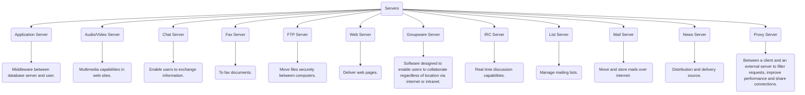
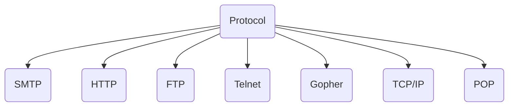

<< [[2022-09-17_Internet_Basics]] | [[]] >>

# ❗❓ Info
Course Name: Internet Technologies
Date: Saturday 17th September 2022
Professor/Speaker: *teach*
Tags: #Internet_Technologies 

---
# 📑 Internet Technologies

## 📃 Summary of Notes
- [Client Server Model](#Client-Server-Model)
	- [Types of Servers](#Type-of-Servers)
- [Protocol](#Protocol)
	- [Standard Protocols](#Standard-Protocols)
	- [Types of Protocol](#Types-of-Protocol)
- [SMTP](#SMTP)
- [POP](#POP)
- [TCP/IP](#TCP/IP)
- [Packet Switching](#Packet_Switching)
	- [Packets](#Packets)
	- [Switching](#Switching)
- [Router](#Router)
- 
---
# **Client Server Model**
- The Client-server model is a *distributed application structure* that partitions task or workload between the providers of a *resource or service*, called *servers*, and *service requesters* called *clients*.

## **Type of Servers**

---
## **Protocol**
- Protocols are a *fundamental aspect* of *digital communication* as they **dictate how to format, transmit and receive data**. They are a **"set of rules"** *that determines how* the ==data will be transmitted over the network==.

### **Standard Protocols** *(Note- have to check this later)*
- Standard protocols are *agreed and accepted* by the **whole computing industry**. It is **not vendor specific**.

### **Types of Protocol**

*and many more..*

## **SMTP**
- SMTP *stands for* **Simple Mail Transfer Protocol**.
- It is an **email communication protocol** that is used by *mail servers* to ==send emails from one account to another via the internet==.
- It uses **port 25**.

## **POP**
- POP *stands for* **Post Office Protocol**.
- Used to retrieve e-mail from a mail server
- *Newer protocol* to do this is [**IMAP**](#IMAP).
- POP has 2 version
	- POP 2 - **Requires SMTP** *to send messages*.
	- POP 3 - *Can Send messages* **with or without SMTP**.

## **TCP/IP**

## **Packet Switching**
- Packet switching is one of the *key concepts of the Internet*.
- It is also known as **Routing** refers to the ==job of transferring the data packets to an appropriate computer==. This involves the use of *two separate concepts*, **packets** & **switching**.
- **Packet switching** is a method of transferring the *data to a network* in the form of **packets**. 

### **Packets**
- In order to *transfer* the ==files fast and efficiently manner over the network== and ==minimize the transmission latency==, the *data is broken down into small pieces* of ==variable length==, called **Packet**.
- Each *packet recieves a header* containing the ==destination IP address, the sender’s IP address, the total number of packets that make up a message, and the sequence number of that packet==.

### **Switching**
- Since the *packets are individually addressed, and numbered for sequence*, they can be *sent and received* in **any order**. This means that *packets can be switched* to **different routes** to *get to the destinations*, ==according to network traffic==.

- *Routing* is done by a **router**.
- When a *packet of data starts from a computer* it is ==submitted to the router==.
- **Router verifies IP address** *of the destination*.
- *Finds the network* to which *datagram* must be submitted.
- *Datagram passes several routers* and *finally reaches the destination network*.
- *Router uses* **routing tables and routing algorithms**.
- *Routing algorithm chooses the next network* to which the *datagram will be routed*. It Chooses according to **data traffic** and **shortest route**.
- Datagrams of the *same message may travel through different routes* to *reach final destination*.
- **Finally TCP protocol verifies** if *all have reached*.

## **Router**
- The router is a *physical or virtual internetworking device* that is *designed to receive, analyze, and forward data packets between computer networks*. A ==router examines a destination IP address of a given data packet==, and it us*es the headers and forwarding tables* to decide the **best way to transfer the packets**.
- A router is used in **LAN** (Local Area Network) and **WAN** (Wide Area Network) environments.

## **WAP**
- WAP *stands for* **Wirless Application Protocol**.
