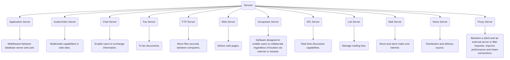
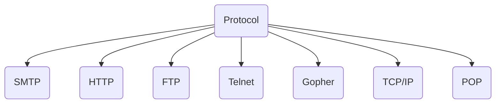
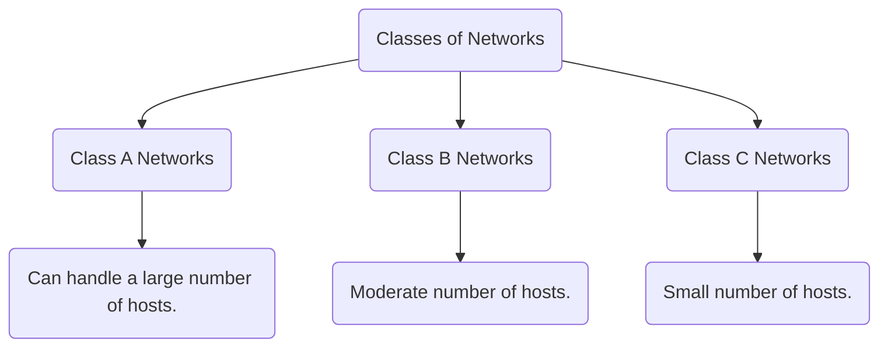

<< [[2022-09-17_Internet_Basics|Internet Basics]] | [[[[|Internet IP Address]]]] >>

# ❗❓ Info
Course Name: Internet Technologies
Date: Saturday 17th September 2022
Professor/Speaker: *teach*
Tags: #Internet_Technologies 

---
# 📑 Internet Technologies

## 📃 Summary of Notes
- [Client Server Model](#Client-Server-Model)
	- [Types of Servers](#Type-of-Servers)
- [Protocol](#Protocol)
	- [Standard Protocols](#Standard-Protocols)
	- [Types of Protocol](#Types-of-Protocol)
		- [SMTP](#SMTP)
		- [POP](#POP)
		- [TCP/IP](#TCP/IP)
- [Packet Switching](#Packet_Switching)
	- [Packets](#Packets)
	-  [Switching](#Switching)
- [Router](#Router)
- [WAP](#WAP)
- [Bluetooth](#Bluetooth)
- [SOAP](#SOAP)
- [IIOP](#IIOP)
- [Internet IP Address](#Internet-IP-Address)
	- [Classes-of-Network](#Classes-of-Network)
		- [Class A Network](#Class-A-Network)
		- [Class B Network](#Class-B-Network)
		- [Class C Network](#Class-C-Network)
- [Domain Name](#Domain-Name)
	- [Domain Registration](#Domain-Registration)
---
# **Client Server Model**
- The Client-server model is a *distributed application structure* that partitions task or workload between the providers of a *resource or service*, called *servers*, and *service requesters* called *clients*.

## **Type of Servers**

---
# **Protocol**
- Protocols are a *fundamental aspect* of *digital communication* as they **dictate how to format, transmit and receive data**. They are a **"set of rules"** *that determines how* the ==data will be transmitted over the network==.

## **Standard Protocols** *(Note- have to check this later)*
- Standard protocols are *agreed and accepted* by the **whole computing industry**. It is **not vendor specific**.

## **Types of Protocol**

*and many more..*

### **SMTP**
- SMTP *stands for* **Simple Mail Transfer Protocol**.
- It is an **email communication protocol** that is used by *mail servers* to ==send emails from one account to another via the internet==.
- It uses **port 25**.

### **POP**
- POP *stands for* **Post Office Protocol**.
- Used to retrieve e-mail from a mail server
- *Newer protocol* to do this is [**IMAP**](#IMAP).
- POP has 2 version
	- POP 2 - **Requires SMTP** *to send messages*.
	- POP 3 - *Can Send messages* **with or without SMTP**.

### **TCP/IP**

---
# **Packet Switching**
- Packet switching is one of the *key concepts of the Internet*.
- It is also known as **Routing** refers to the ==job of transferring the data packets to an appropriate computer==. This involves the use of *two separate concepts*, **packets** & **switching**.
- **Packet switching** is a method of transferring the *data to a network* in the form of **packets**. 

## **Packets**
- In order to *transfer* the ==files fast and efficiently manner over the network== and ==minimize the transmission latency==, the *data is broken down into small pieces* of ==variable length==, called **Packet**.
- Each *packet recieves a header* containing the ==destination IP address, the sender’s IP address, the total number of packets that make up a message, and the sequence number of that packet==.

## **Switching**
- Since the *packets are individually addressed, and numbered for sequence*, they can be *sent and received* in **any order**. This means that *packets can be switched* to **different routes** to *get to the destinations*, ==according to network traffic==.

- *Routing* is done by a **router**.
- When a *packet of data starts from a computer* it is ==submitted to the router==.
- **Router verifies IP address** *of the destination*.
- *Finds the network* to which *datagram* must be submitted.
- *Datagram passes several routers* and *finally reaches the destination network*.
- *Router uses* **routing tables and routing algorithms**.
- *Routing algorithm chooses the next network* to which the *datagram will be routed*. It Chooses according to **data traffic** and **shortest route**.
- Datagrams of the *same message may travel through different routes* to *reach final destination*.
- **Finally TCP protocol verifies** if *all have reached*.

---
# **Router**
- The router is a *physical or virtual internetworking device* that is *designed to receive, analyze, and forward data packets between computer networks*. A ==router examines a destination IP address of a given data packet==, and it us*es the headers and forwarding tables* to decide the **best way to transfer the packets**.
- A router is used in **LAN** (Local Area Network) and **WAN** (Wide Area Network) environments.

---
# **WAP**
- WAP *stands for* **Wirless Application Protocol**.
- *Secure specification* that allows users to *access internet* via **handheld wireless devices**.
- Supported by all **Operating Systems** (*OS*).
- [*WML*](#wml) is specifically designed for **small screens**.
---

# **Bluetooth**
- **Short range radio** technology *aimed at simplifying communications*.
- *Simplifies data synchronization* between ==net devices and other computers==.

---
# **SOAP**
- SOAP *stands for* **Simple Object Access Protocol**.
- It is a *messaging protocol* allowing programs to *communicate between different operating systems* such as ==Windows and Linux==. 
- It uses **XML for format its messages** while using *HTTP* and [*SMTP*](#SMTP) to ==transmit those messages over a network==.

---
# **IIOP**
- IIOP *stands for* **Internet Inter-ORB Protocol**.
- It is a *protocol that makes it feasible* for ==distributed applications written in various programming languages== to *interact over the Internet*.
- *IIOP is a vital aspect* of a **major industry standard**, the ==CORBA==.
- IIOP by **OMG** (*Object Management Group*).

---
# **Internet IP Address**
- IP stands for "Internet Protocol," 
- An IP address is a **unique address** that *identifies a device on the internet* or a *local network*. which is the *set of rules governing the format of data* sent via the *internet or local network*.
- *IP addresses are expressed* as a **set of four numbers** *separated by period.* 
- *ex -* 18.10.200.14 , 185.25.85.141
- *Each number* in the **array is an eight bit integer** called an **octet**.
- The *set can range* from **0 to 255**.
- The number of networks and the number of hosts per class can be derived by this formula :-
	- Number of networks -> (2network_bits)
	- Number of hosts/Network -> (2host_bits - 2)

## **IP Address**
![[ip_address.png]]

## **Classes of Network** 
- **3 classes** of *Networks depending* on the number of hosts it can handle.

- ### **Class A Network**
	- General form is **N.H1.H2.H3**
		- (**N** - {*Network ID*} *ranges* from **1 to 127**)
		- (**H1**, **H2**, **H3** - {*Hosts*} *ranges* from **0 to 255**)
	- The *first bit* of the **first octet is always** set to **0**.
		- thus the *first octet ranges from* **1 – 127**.
		- **ex-** 00000001- 01111111
	- There are **126 Class A Networks**. The *IP range 127* is ==reserved for loopback IP addresses==.
	- *Class A addressing* can have **126 networks** and **16777214 hosts**(224 – 2)
		- thus *Class A IP address format* is-
			- 0NNNNNNN.HHHHHHHH.HHHHHHHH.HHHHHHHH

- ### **Class B Network**
	- General form is **N1.N2.H1.H2**
		- (**N1** *ranges* from **128 – 191**)
		- (**N2** *ranges* from **0 – 255**)
		- (**H1** and **H2** *may range* from **0 to 255**)
	- The *first two bits* in the **first octet** set to **10**.
		- **ex-** 10000000 - 10111111 (128 - 191)
	- Class B has **16384 (214) Network addresses** and **65534 (216-2) Host addresses**.
		- thus *Class B IP address format* is-
			- 10NNNNNN.NNNNNNNN.HHHHHHHH.HHHHHHHH
- ### **Class C Network**
	- General form is **N1.N2.N3.H**
	- (**N1** *ranges* from **192 to 233**)
	- (**N2, N3** *vary* from **0 to 255**)
	- (**H** *ranges* from **0 to 255**)
	- The **first octet** has it's **first 3 bits set to 110**.
		- **ex-** 11000000 - 11011111 (192 - 223)
	- Class C has **2097152 (221) Network addresses** and **254 (28-2) Host addresses**.
		- thus *Class C IP address format* is-
			- 110NNNNN.NNNNNNNN.NNNNNNNN.HHHHHHHH

---
# **Domain Name**
- A name that identifies *1 or more IP addresses*.
- Domain names are used in *URL* to ==identify a particular web page==.
- Every domain name has a **suffix** that indicates which **top level domain** *it belongs to*.
	- **Example-** 
		1) .com – commercial business
		2) .gov – government agencies
		3) .edu – educational institutes
		4) .org – organizations
		5) .mil – military
		6) .net – network organizations
		7) .ca - Canada, *etc.*
- *Host machines actually* have [**IP**](#Internet-IP-Address) **addresses**, ==not domain names==.
- IP addresses have the form -> *255.255.255.255*
- A series of *Domain Name Servers keep lists* which ==map domain names to IP addresses==.

## **Domain Registration**
- The first and the ==most important thing to find out== is *whether the name you have shortlisted is available* or is *taken by someone else*. In order to check *domain availability* you can *search it at* **domain registrar**.
- If the *domain name is available for registration* you can *then claim it*. The next thing to do is to *find a registrar*. Before making a choice it is always advised to do a quick research on different registrars. One can search from a number of options and see who offers the best price for registration.
- Registrars nowadays also offer *different add on services in order to lure customers*, so one can make a choice accordingly. Once you have **shortlisted the registrar** you need to do a ==search for the domain on the registrar’s website==.
- If the *domain is still available for registration* you can ==proceed further with the registration process==. Make the *payment for registration to the registrar*.
- **Registrar Examples–** GoDaddy.com, Ernet India, *etc.*

---
# **Internet Services**