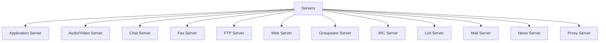

<< [[2022-09-17_Internet_Basics]] | [[]] >>

# ❗❓ Info
Course Name: Internet Technologies
Date: Saturday 17th September 2022
Professor/Speaker: *teach*
Tags: #Internet_Technologies 

---
# 📑 Internet Technologies

## 📃 Summary of Notes
- [Client Server Model](#Client-Server-Model)
	- [Types of Servers](#Type-of-Servers)
		- [Types of Internet Connections](#types-of-internet-connections)
---
# **Client Server Model**
- The Client-server model is a *distributed application structure* that partitions task or workload between the providers of a *resource or service*, called *servers*, and *service requesters* called *clients*.

## **Type of Servers**

