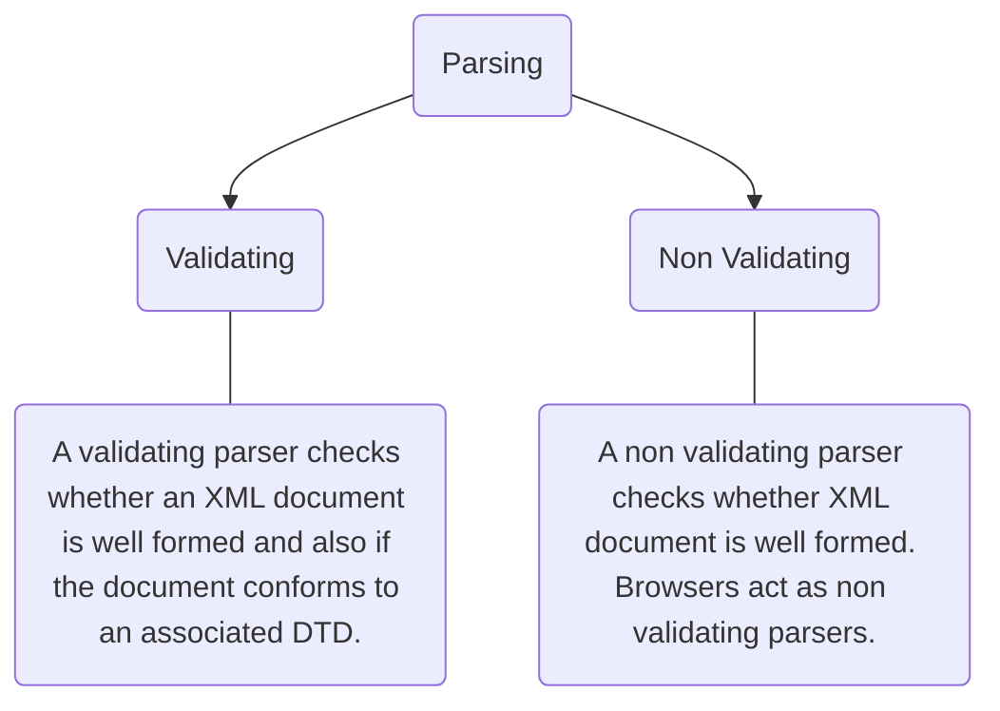
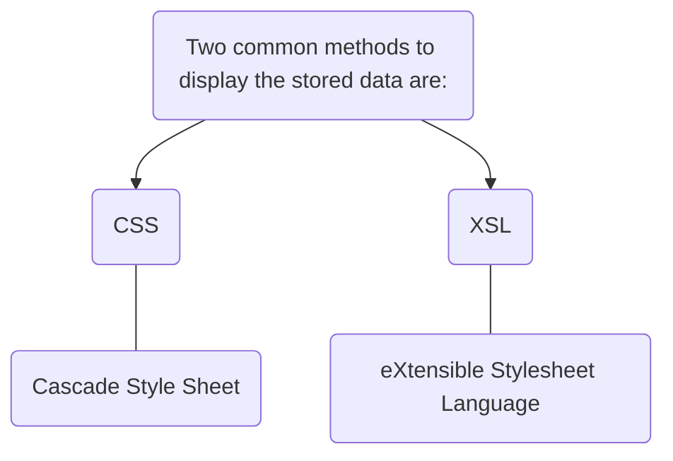

<< [[m3_syllabus|Syllabus Module 3]] | [[2022-10-16]] >>

# ❗❓ Info
Course Name: Internet Technologies
Date: Saturday 15th October 2022
Professor/Speaker: *teach*
Tags: #xml

---
# 📑 XML

## 📃 Summary of Notes
- [XML Technologies](#XML)
	- [XML vs HTML](#XML-vs-HTML)
	- [XML Structure](#XML-Structure)
		- [XML Syntax](#XML-Syntax)
		- [Prolog](#Prolog)
		- [Body](#Body)
	- [Well Formed](#Well-Formed)
		- [XML Rules](#XML-Rules)
	- [XML Example](#XML-Example)
	- [XML Declaration](#XML-Declaration)
	- [XML Element](#XML-Element)
	- [Naming Rules](#Naming-Rules)
	- [Empty Elements](#Empty-Elements)
	- [XML Attributes](#XML-Attributes)
	- [Parsing](#Parsing)
	- [XML Special Characters](#XML-Special-Characters)
	- [Elements vs Attributes](#Elements-vs-Attributes)
	- [Displaying XML](#*Displaying XML)
	- [XML Namespaces](#XML-Namespaces)
---
# **XML**
- XML *stands for* **[[xml|eXtensible Markup Language]]**.
- XML is a **markup language** much like HTML.
- XML was designed to **store** and **transport data**.
- a software and hardware independent way of storing, transporting, and sharing data.

## **XML vs HTML**
| **XML**                                                                                                                 | **HTML**                                                          |
| ----------------------------------------------------------------------------------------------------------------------- | ----------------------------------------------------------------- |
| XML is a **software and hardware independent tool** used to _transport and store data_. It ==focuses on what data is==. | HTML is used to **display data** and _focuses on how data looks_. |
| Case sensitive.                                                                                                         | Case insensitive.                                                 |
| You can defines your own tags.                                                                                          | Predefined tags.                                                  |
| Mandatory to use a closing tag.                                                                                         | Not necessary to use a closing tag.                               |
| It is **dynamic** because it is used to _transport data_.                                                               | It is **static** because it is used to _display data_.            |
| It **Preserve whitespaces**.                                                                                            | It does **not** _preserve whitespaces_.                           |

## **XML Structure**
- XML documents are *formed as element trees*.
- An XML tree starts at a **root element** and *branches from the root to child elements*. 
- All elements can have *sub elements* (==child elements==).

### **XML Syntax**
```xml
<root>
  <child>
    <subchild>...</subchild>
  </child>
</root>
```


- XML Document consists of:
	1) [Prolog](#Prolog)
	2) [Body](#Body)

### **Prolog**
- The prolog consists of an [XML declaration](#declaration).
- This line is called the XML **prolog**:-
```xml
	<?xml version="1.0" encoding="UTF-8"?>
```
- The XML prolog is ***optional***. ==If it exists, it must *come first* in the document==.
- XML documents can *contain international characters*
	- Example: Norwegian **øæå** or French **êèé**.

### **Body**
- This portion of the XML document *contains textual data marked up by tags*.
- It must have *one element* called the **document element or root element**, which ==defines the content in the XML document==.

---
## **Well Formed**
- An XML document is called well-formed if it satisfies certain [rules](#XML-Rules), *specified by the W3C*.

### **XML Rules**
- XML **documents** *must have a* **root element**.
- XML **elements** *must have a* **closing tag**.
- XML **tags** are **case sensitive**.
- XML **elements** *must be* **properly nested**.
- XML **attribute** *values must be* **quoted**.
- All **empty elements** *must be* **closed**.

---
## **XML Example**
- XML documents *begin with a XML [declaration](#XML-Declaration)* ==which is optional==.
```xml
<?xml version="1.0" encoding="UTF-8" ?>
<library>
	<book>
		<title>Atomic Habits</title>
		<author>James Clear</author>
		<genre>Self-help</genre>
		<publisher>Penguin Random House</publisher>
		<price>$14.99</price>
	</book>
	<book>
		<title>Rich Dad, Poor Dad</title>
		<author>Robert Kiyosaki, Sharon Lechter</author>
		<genre>Personal finance, Non-fiction</genre>
		<publisher>Warner Books</publisher>
		<price>$8.99</price>
	</book>
</library>
```

---
## **XML Declaration**
```xml
	<?xml version="1.0" encoding="UTF-8" ?standalone=”yes”>
```
- **version** - *simply* ==XML Version==.
- **encoding** - It designates the character set used by the XML document. 
					- ISO-8859-1 *(English and many Western European languages)*
- **standalone** - It defines whether a document requires a **[Document Type Definition](#DTD)**(defines the elements and attributes that can be used in a document).

---
## **XML Element**
- An XML element is everything from (*including*) the **element's start tag** to (*including*) the **element's end tag**.
- *Information contained within the tags* is called **content**.
- An element can contain: 
	- text
	- attributes 
	- other elements
	- or a mix of the above.
![[xml_help.png]]

---
## **Naming Rules**
- Names can only contain **letters, digits and some other special characters**.
- **Cannot start** with a *number or punctuation marks*.
- Must **not contain** the string “*xml*”,”*XML*” or “*Xml*”
- ==Cannot contain whitespace==.

---
## **Empty Elements**
- Empty Elements ***don’t have any content***.
- Can have *attributes*.
- **Must have a closing tag**

---
## **XML Attributes**
- Attributes are designed to **contain data** *related to a specific element*.
- They are *placed before the closing bracket* of the **starting tag**.
- example: here **date="2008-01-10"** is the attribute.
```xml
	<note date="2008-01-10">
		<to>Steve</to>
		<from>John</from>
	</note> 
```

---
## **Parsing**
- A parser is used to check whether a document is [Well Formed](#Well-Formed).
- There are 2 types of parsing:


---
## **XML Special Characters**

| **Symbol (name)**              	| **Escape Sequence** 	|
|--------------------------------	|---------------------	|
| < (less-than)                  	| `&#60;` or `&lt;`   	|
| > (greater-than)               	| `&#62;` or `&gt;`   	|
| & (ampersand)                  	| `&#38;`             	|
| ' (apostrophe or single quote) 	| `&#39;`             	|
| " (double-quote)               	| `&#34;`             	|

---
## **Elements vs Attributes**
| **Elements**                                                                                                  	    | **Attributes**                                                                                          	    |
|---------------------------------------------------------------------------------------------------------------	|---------------------------------------------------------------------------------------------------------	|
| They are the **main building blocks** of _both XML and HTML_ documents.                                       	        | They provide **extra information** _about elements_.                                                    	    |
| They contain text, other elements, or can be empty.                                                           	| Attributes are always placed inside the opening tag of an element.                                      	|
| ```<person> 	<gender>female</gender> 		<firstname>Rias</firstname> 		<lastname>Gremory</lastname> </person>``` 	    | ```<person gender = "female"> 	<firstname>Rias</firstname> 	<lastname>Gremory</lastname> </person>``` 	        |

*and if you are looking for which is the best please visit here:* https://stackoverflow.com/a/25764306

---
## **Displaying XML**
- XML documents do not carry information on how to display data.
- Raw XML files can be viewed in all major browsers.


---
## **XML Namespaces**
- A Namespace is a **set of unique names**. 
- Namespace is a mechanisms by which *element and attribute* ==name can be assigned to a group==. 
- The Namespace *is identified by [URI](#URI)* (**Uniform Resource Identifier**).
- *In short*: XML Namespaces provide a method to **avoid element name conflicts**.
- Syntax:
```xml
<element xmlns:name = "URL">
```

### **xmlns Attribute**
- When using *prefixes* in XML, a **namespace** for the *prefix must be defined*.
- The namespace can be defined by an **xmlns** attribute in the start tag of an element. 

- for an example we wanna add 2 tables in one
- table 1
```
<trip>
	<class>
		<students>
			<name>Astro Boy</name>
			<name>Saitama</name>
			<name>Makima</name>
			<name>Kyouma Hououin</name>
			<name>Gon Freecss</name>
		</students>
	</class>
</trip>
```
- table 2
```
<trip>
	<class>
		<students>
			<name>Kurisu Makise</name>
			<name>Levi Ackerman</name>
			<name>Fubuki</name>
			<name>## Gintoki</name>
			<name>Arsène Lupin III</name>
			<name>Akeno Himejima</name>
		</students>
	</class>
</trip>
```

- after merging-
```xml
<root
	xmlns:a="https://www.class1.com"
	xmlns:b="https://www.class2.com">
	<a:trip>
		<a:class>
			<a:students>
				<a:name>Astro Boy</a:name>
				<a:name>Saitama</a:name>
				<a:name>Makima</a:name>
				<a:name>Kyouma Hououin</a:name>
				<a:name>Gon Freecss</a:name>
			</a:students>
		</a:class>
	</a:trip>
	<b:trip>
		<b:class>
			<b:students>
				<b:name>Kurisu Makise</b:name>
				<b:name>Levi Ackerman</b:name>
				<b:name>Fubuki</b:name>
				<b:name>## Gintoki</b:name>
				<b:name>Arsène Lupin III</b:name>
				<b:name>Akeno Himejima</b:name>
			</b:students>
		</b:class>
	</b:trip>
</root>
```

---
## **XML Validation**
- An XML document with *correct syntax* is called "**Well Formed**".
- A well formed XML document can be validated against DTD or Schema.

