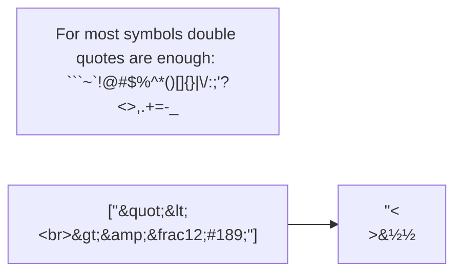

```mermaid
flowchart LR
  A["For most symbols double quotes are enough: ```~`!@#$%^*()[]{}|\/:;'?<>,.+=-_"]
  B["[&quot;&amp;quot;&amp;lt;&lt;br&gt;&amp;gt;&amp;amp;&amp;frac12;#35;189;&quot;]"]
  B --> C["&quot;&lt;<br>&gt;&amp;&frac12;#189;"]
```
