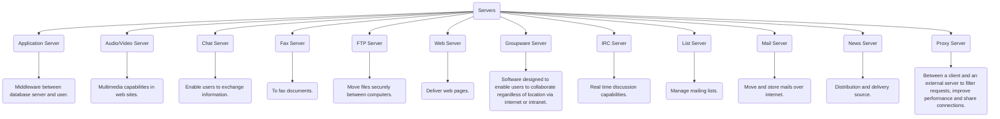
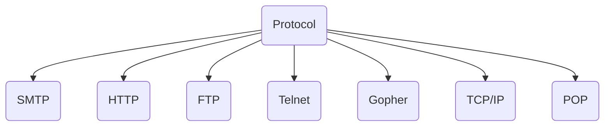
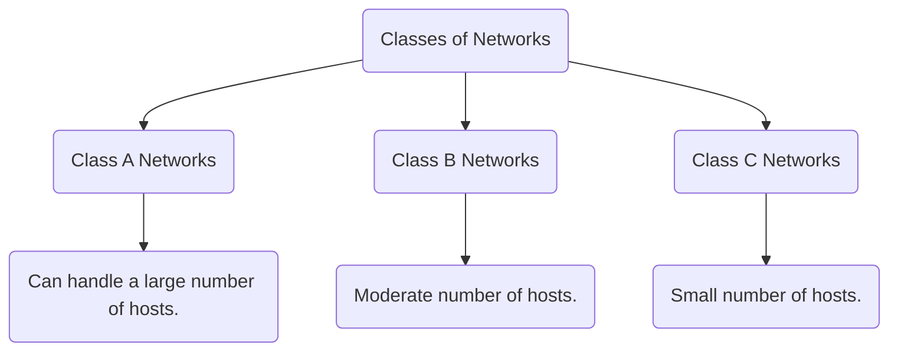
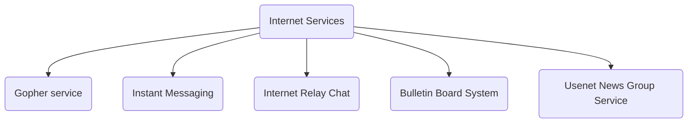
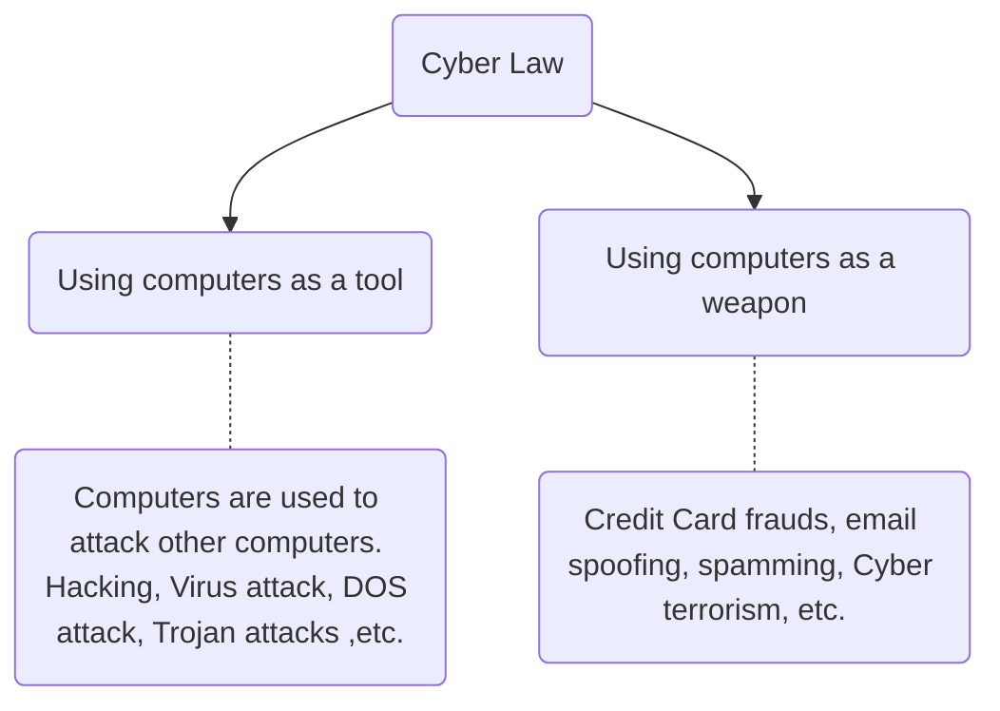
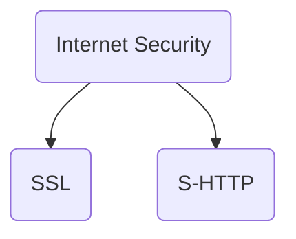
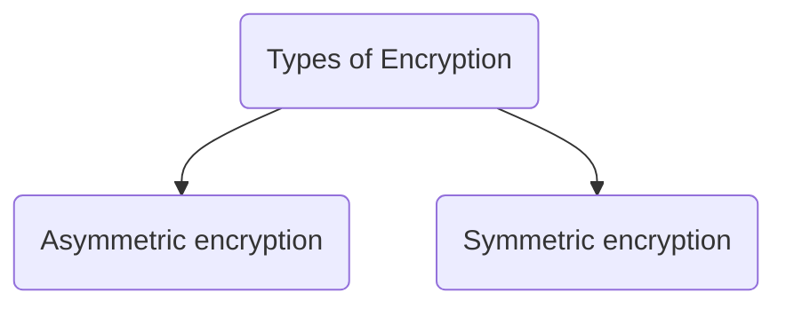

<< [Internet Basics](Sem_3/IT/Classes_Notes/Module_1/2022-09-17-Internet_Basics) |

# ❗❓ Info
Course Name: Internet Technologies
Course Code: CA220
Date: Saturday 17th September 2022
Professor/Speaker: *teach*
Tags: #Internet_Technologies 

---
# 📑 Internet Technologies

## 📃 Summary of Notes
- [❗❓ Info](#-info)
- [📑 Internet Technologies](#-internet-technologies)
	- [📃 Summary of Notes](#-summary-of-notes)
- [**Client Server Model**](#client-server-model)
	- [**Type of Servers**](#type-of-servers)
- [**Protocol**](#protocol)
	- [**Standard Protocols** *(Note- have to check this later)*](#standard-protocols-note--have-to-check-this-later)
	- [**Types of Protocol**](#types-of-protocol)
		- [**SMTP**](#smtp)
		- [**POP**](#pop)
		- [**TCP/IP**](#tcpip)
- [**Packet Switching**](#packet-switching)
	- [**Packets**](#packets)
	- [**Switching**](#switching)
- [**Router**](#router)
- [**WAP**](#wap)
- [**Bluetooth**](#bluetooth)
- [**SOAP**](#soap)
- [**IIOP**](#iiop)
- [**Internet IP Address**](#internet-ip-address)
	- [**IP Address**](#ip-address)
	- [**Classes of Network**](#classes-of-network)
- [**Domain Name**](#domain-name)
	- [**Domain Registration**](#domain-registration)
- [**Internet Services**](#internet-services)
	- [**Gopher Service**](#gopher-service)
	- [**Instant Messaging**](#instant-messaging)
	- [**Internet Relay Chat**](#internet-relay-chat)
	- [**BBS**](#bbs)
	- [**Usenet News Group Service**](#usenet-news-group-service)
- [**Electronic Mail**](#electronic-mail)
- [**WWW**](#www)
- [**Web Server**](#web-server)
- [**Web Client**](#web-client)
- [**Web Technologies**](#web-technologies)
- [**Cookies**](#cookies)
- [**Cyber Laws**](#cyber-laws)
- [**URL**](#url)
	- [**Parts of a URL**](#parts-of-a-url)
	- [**Parts of a HTTP URL**](#parts-of-a-http-url)
	- [**URL Examples**](#url-examples)
- [**Internet Security**](#internet-security)
	- [**SSL**](#ssl)
	- [**S-HTTP**](#s-http)
- [**Encryption**](#encryption)
	- [**Types of Encryption**](#types-of-encryption)
		- [**Asymmetric encryption**](#asymmetric-encryption)
		- [**Symmetric encryption**](#symmetric-encryption)
- [**E-Commerce and EDI**](#e-commerce-and-edi)
- [**Digital Cash**](#digital-cash)
- [**Digital Signature**](#digital-signature)
- [**HTTP**](#http)
	- [**Request/Response**](#requestresponse)
---
# **Client Server Model**
- The Client-server model is a *distributed application structure* that partitions task or workload between the providers of a *resource or service*, called *servers*, and *service requesters* called *clients*.

## **Type of Servers**

---
# **Protocol**
- Protocols are a *fundamental aspect* of *digital communication* as they **dictate how to format, transmit and receive data**. They are a **"set of rules"** *that determines how* the ==data will be transmitted over the network==.

## **Standard Protocols** *(Note- have to check this later)*
- Standard protocols are *agreed and accepted* by the **whole computing industry**. It is **not vendor specific**.

## **Types of Protocol**

*and many more..*

### **SMTP**
- SMTP *stands for* **Simple Mail Transfer Protocol**.
- It is an **email communication protocol** that is used by *mail servers* to ==send emails from one account to another via the internet==.
- It uses **port 25**.

### **POP**
- POP *stands for* **Post Office Protocol**.
- Used to retrieve e-mail from a mail server
- *Newer protocol* to do this is [**IMAP**](#IMAP).
- POP has 2 version
	- POP 2 - **Requires SMTP** *to send messages*.
	- POP 3 - *Can Send messages* **with or without SMTP**.

### **TCP/IP**

---
# **Packet Switching**
- Packet switching is one of the *key concepts of the Internet*.
- It is also known as **Routing** refers to the ==job of transferring the data packets to an appropriate computer==. This involves the use of *two separate concepts*, **packets** & **switching**.
- **Packet switching** is a method of transferring the *data to a network* in the form of **packets**. 

## **Packets**
- In order to *transfer* the ==files fast and efficiently manner over the network== and ==minimize the transmission latency==, the *data is broken down into small pieces* of ==variable length==, called **Packet**.
- Each *packet recieves a header* containing the ==destination IP address, the sender’s IP address, the total number of packets that make up a message, and the sequence number of that packet==.

## **Switching**
- Since the *packets are individually addressed, and numbered for sequence*, they can be *sent and received* in **any order**. This means that *packets can be switched* to **different routes** to *get to the destinations*, ==according to network traffic==.

- *Routing* is done by a **router**.
- When a *packet of data starts from a computer* it is ==submitted to the router==.
- **Router verifies IP address** *of the destination*.
- *Finds the network* to which *datagram* must be submitted.
- *Datagram passes several routers* and *finally reaches the destination network*.
- *Router uses* **routing tables and routing algorithms**.
- *Routing algorithm chooses the next network* to which the *datagram will be routed*. It Chooses according to **data traffic** and **shortest route**.
- Datagrams of the *same message may travel through different routes* to *reach final destination*.
- **Finally TCP protocol verifies** if *all have reached*.

---
# **Router**
- The router is a *physical or virtual internetworking device* that is *designed to receive, analyze, and forward data packets between computer networks*. A ==router examines a destination IP address of a given data packet==, and it us*es the headers and forwarding tables* to decide the **best way to transfer the packets**.
- A router is used in **LAN** (Local Area Network) and **WAN** (Wide Area Network) environments.

---
# **WAP**
- WAP *stands for* **Wirless Application Protocol**.
- *Secure specification* that allows users to *access internet* via **handheld wireless devices**.
- Supported by all **Operating Systems** (*OS*).
- [*WML*](#wml) is specifically designed for **small screens**.
---

# **Bluetooth**
- **Short range radio** technology *aimed at simplifying communications*.
- *Simplifies data synchronization* between ==net devices and other computers==.

---
# **SOAP**
- SOAP *stands for* **Simple Object Access Protocol**.
- It is a *messaging protocol* allowing programs to *communicate between different operating systems* such as ==Windows and Linux==. 
- It uses **XML for format its messages** while using *HTTP* and [*SMTP*](#SMTP) to ==transmit those messages over a network==.

---
# **IIOP**
- IIOP *stands for* **Internet Inter-ORB Protocol**.
- It is a *protocol that makes it feasible* for ==distributed applications written in various programming languages== to *interact over the Internet*.
- *IIOP is a vital aspect* of a **major industry standard**, the ==CORBA==.
- IIOP by **OMG** (*Object Management Group*).

---
# **Internet IP Address**
- IP stands for "Internet Protocol," 
- An IP address is a **unique address** that *identifies a device on the internet* or a *local network*. which is the *set of rules governing the format of data* sent via the *internet or local network*.
- *IP addresses are expressed* as a **set of four numbers** *separated by period.* 
- *ex -* 18.10.200.14 , 185.25.85.141
- *Each number* in the **array is an eight bit integer** called an **octet**.
- The *set can range* from **0 to 255**.
- The number of networks and the number of hosts per class can be derived by this formula :-
	- Number of networks -> (2network_bits)
	- Number of hosts/Network -> (2host_bits - 2)

## **IP Address**

## **Classes of Network** 
- **3 classes** of *Networks depending* on the number of hosts it can handle.

- ### **Class A Network**
	- General form is **N.H1.H2.H3**
		- (**N** - {*Network ID*} *ranges* from **1 to 127**)
		- (**H1**, **H2**, **H3** - {*Hosts*} *ranges* from **0 to 255**)
	- The *first bit* of the **first octet is always** set to **0**.
		- thus the *first octet ranges from* **1 – 127**.
		- **ex-** 00000001- 01111111
	- There are **126 Class A Networks**. The *IP range 127* is ==reserved for loopback IP addresses==.
	- *Class A addressing* can have **126 networks** and **16777214 hosts**(224 – 2)
		- thus *Class A IP address format* is-
			- 0NNNNNNN.HHHHHHHH.HHHHHHHH.HHHHHHHH

- ### **Class B Network**
	- General form is **N1.N2.H1.H2**
		- (**N1** *ranges* from **128 – 191**)
		- (**N2** *ranges* from **0 – 255**)
		- (**H1** and **H2** *may range* from **0 to 255**)
	- The *first two bits* in the **first octet** set to **10**.
		- **ex-** 10000000 - 10111111 (128 - 191)
	- Class B has **16384 (214) Network addresses** and **65534 (216-2) Host addresses**.
		- thus *Class B IP address format* is-
			- 10NNNNNN.NNNNNNNN.HHHHHHHH.HHHHHHHH
- ### **Class C Network**
	- General form is **N1.N2.N3.H**
	- (**N1** *ranges* from **192 to 233**)
	- (**N2, N3** *vary* from **0 to 255**)
	- (**H** *ranges* from **0 to 255**)
	- The **first octet** has it's **first 3 bits set to 110**.
		- **ex-** 11000000 - 11011111 (192 - 223)
	- Class C has **2097152 (221) Network addresses** and **254 (28-2) Host addresses**.
		- thus *Class C IP address format* is-
			- 110NNNNN.NNNNNNNN.NNNNNNNN.HHHHHHHH

---
# **Domain Name**
- A name that identifies *1 or more IP addresses*.
- Domain names are used in *URL* to ==identify a particular web page==.
- Every domain name has a **suffix** that indicates which **top level domain** *it belongs to*.
	- **Example-** 
		1) .com – commercial business
		2) .gov – government agencies
		3) .edu – educational institutes
		4) .org – organizations
		5) .mil – military
		6) .net – network organizations
		7) .ca - Canada, *etc.*
- *Host machines actually* have [**IP**](#Internet-IP-Address) **addresses**, ==not domain names==.
- IP addresses have the form -> *255.255.255.255*
- A series of *Domain Name Servers keep lists* which ==map domain names to IP addresses==.

## **Domain Registration**
- The first and the ==most important thing to find out== is *whether the name you have shortlisted is available* or is *taken by someone else*. In order to check *domain availability* you can *search it at* **domain registrar**.
- If the *domain name is available for registration* you can *then claim it*. The next thing to do is to *find a registrar*. Before making a choice it is always advised to do a quick research on different registrars. One can search from a number of options and see who offers the best price for registration.
- Registrars nowadays also offer *different add on services in order to lure customers*, so one can make a choice accordingly. Once you have **shortlisted the registrar** you need to do a ==search for the domain on the registrar’s website==.
- If the *domain is still available for registration* you can ==proceed further with the registration process==. Make the *payment for registration to the registrar*.
- **Registrar Examples–** GoDaddy.com, Ernet India, *etc.*

---
# **Internet Services**

## **Gopher Service**
- Internet Gopher Protocol ==acts as distributed document delivery system==.
- Gopher Client software presents users with a *heirarchy of items and directories like a file system*.
## **Instant Messaging**
- *Enables to create* a **private chat room** *with another individual*.
## **Internet Relay Chat**
- provides a platform for the users to chat
## **BBS**
- BBS *stands for* **Bulletin Board System**.
- Electronic message center which *serves specific interest groups*. ==Good place to find free or inexpensive software products==.
## **Usenet News Group Service**
- Worldwide bulletin board system *that can be accessed through internet* or *through other online services*.

---
# **Electronic Mail**
- *Transmission of messages* over **communication networks**.
- *Send messages to* **several users at once** – ==broadcasting==.
- All *online services and ISP's* ==offer email and support gateways==.
- PC – **MAPI** (*Messaging Application Programming Interface*) is an **email standard**.

---
# **WWW**
- WWW *stands for* **World Wide Web**.
- The Web contains the **information organized** in Web pages *containing text and graphic images*.
- It contains *hypertext links*, or ==highlighted keywords== and *images* that lead to related information.
	- ## **Web Site**
		- A *collection of linked Web pages* that has a *common theme* is called a **Web Site**.
	- ## **Home Page**
		- The *main page* that *all of the pages on a particular Web site are organized around* and *link back to* is called the site’s **Home Page**.

---
# **Web Server**
- A web server is a *computer system that processes requests via* [**HTTP**](#HTTP), ==the basic network protocol used to distribute information== *on [WWW](#WWW)*.
- The *primary function* of a web server is to **store, process** and **deliver** *web pages to clients*. The *communication between client and server* takes place using the [HTTP](#HTTP). *Pages delivered are most frequently* [**HTML**](#html) **documents**, which ==may include images==, ==style sheets== and ==scripts in addition to text content==.
- *Example–* Apache HTTP Server, Microsoft IIS, *etc.*

---
# **Web Client**
- A **Web browser** that contains basic software you need in order to ==find, retrieve, view, and send information over the Internet==.
- *Example-* IE, Firefox, Google Chrome, *etc.*
	- This includes software that lets you:-
		1. Send and receive electronic-mail (or e-mail) messages worldwide nearly instantaneously.
		2. Read messages from newsgroups (or forums) about thousands of topics in which users share information and opinions.
		3. Browse the World Wide Web (or Web) where you can find a rich variety of text, graphics, and interactive information.

---
# **Web Technologies**
- Web uses *http to transmit data*.
- Web services *use web to share information*.
- Web page information is presented using the following technologies.
	- HTML
	- JSP (Java Server Page)
	- Javasript
	- ASP (Active Server Page)
	- Java Applets
- *Plug-in* **Hardware** or **Software module** that *adds a specific feature or service to a larger system*.

---
# **Cookies**
- *Messages that a web server transmits* to a web browser so that **web server can keep track of users activity on a specific web site**.
- *Stored as* a **text file**.
- To **collect demographic information** *about who is visiting the web site*.
- To *personalize **users experience***.
- To *Keep track of* what =="ads" it lets you see and how often you see==.
- **Six parameters** that can be *passed to a web site*-
	- Name of the cookie
	- Value of the cookie
	- Expiration date
	- Path - *Sets the URL path* the *cookie is valid in*.
	- Domain - *Accessible to pages on any* of the *servers*.
	- Secure Connection - Site using **SSL** (*Secure Socket Layer*- **protocol** for *web browser* and **server** for *authentication*, **encryption** & **decryption** *of data*.)

---
# **Cyber Laws**
- Internet is *growing drastically*. New and sensitive issues related to various legal *aspects of cyberspace started cropping up*.
- ==Highly specialized branch of law came into existence== called **Cyber Law**(Law of internet and World Wide Web).
- Cyber Crimes *involves traditional criminal activities* such as **theft, fraud, forgery, defamation and mischief**.
- ==Cyber Law regulates these crimes.==
- *Cyber Crimes can be categorized into 2 types :-*

---
# **URL**
- A **URL allows every resource** (ex- *HTML page, image, sound clip ,etc.*) on the [**WWW**](#WWW) ==to have a unique address==.
- A *resource is used to represent basic elements* in the web which can be ==identified, named and addressed==.
- *Resource on* the *web is identified by an address* called **Uniform Resource Locator**.
- *Subset* of *[[URI|URI]]* (**Uniform Resource Identifier**).

## **Parts of a URL**

- The *protocol gives the method of communication to be used*. *"http"* is *most common*, but you may see **ftp** as well.

## **Parts of a HTTP URL**
- **protocol** – 
- **host –**
- **port -**
- **path –**
- **params –**
- **anchor –**

## **URL Examples**

---
# **Internet Security**

## **SSL** 
- It is the *standard security technology for establishing* an **encrypted link between a web server** and ==a browser==. *This link ensures that all data passed between the web server and browsers remain* ==private and integral==.
## **S-HTTP** 
- Designed to *transmit **individual** messages securely*

---
# **Encryption**
- Most effective way to achieve data security.
- Involves *translation of data into a secret code*.
- To *read an encrypted file you must have* access to a **secret key** that *enables to decrypt it*.
- **Unencrypted data** – *plain text*.
- **Encrypted data** – *cipher text*.

## **Types of Encryption**

### **Asymmetric encryption**
- *Cryptographic system* that uses *two keys* – a **public key** *known to everyone* and a **private key** known *only to the recipient of the message*. 
- If *A* wants to *send a message* to *B* , **A** uses **B's public key** *to encrypt the message*. **B** then *uses his private key to decrypt it*.
### **Symmetric encryption**
- **Same key** is used to *encrypt and decrypt a message*.

---
# **E-Commerce and EDI**
| **E-Commerce**                                                                                                                                                | **EDI**                                                                                                                           |
| ------------------------------------------------------------------------------------------------------------------------------------------------------------- | --------------------------------------------------------------------------------------------------------------------------------- |
| E-commerce is the *buying and selling of goods and services*, or the *transmitting of funds or data*, ==over an electronic network, primarily the internet==. | EDI is the **computer-to-computer exchange** of ==business documents in a standard electronic format between business partners==. |
| These *business transactions occur either* as ==business-to-business, business-to-consumer, consumer-to-consumer or consumer-to-business==.                   |                                                                                                                                   |
| E-Commerce stands for **Electronic Commerce**.                                                                                                                | EDI *stands for* **Electronic Data Interchange**.                                                                                 |

---
# **Digital Cash**
- Digital Cash is a *system of purchasing cash credits* in relatively small amounts, **storing the credits in your computer**, and ==then spending them when making electronic purchases over the Internet==.
- It *acts much like real cash*, ==except that it’s *not on paper*==. "*Money*" in your **bank account is converted to a digital code**. This *digital code may then be stored on* **a microchip, a pocket card** (*like a smart card*), **or on the hard drive of *your computer***.
- The *concept of* **privacy** is the ==driving force behind digital cash==. The **user of digital cash is assured an anonymous transaction** by *any vendor who accepts it*.
- ==Your special bank account code can be used over the internet== or at *any participating merchant to purchase an item*.
- Everybody *involved in the transaction*, ==from the bank to the user to the vendor==, **agree to recognize the worth of the transaction**, and *thus create this new form*.

---
# **Digital Signature**
- A digital signature is a *mathematical scheme* for **demonstrating the authenticity of digital *messages or documents***.
- A valid *digital signature* *gives a recipient reason to believe* that the **message was created by a known sender** (*authentication*), that **the sender cannot deny having sent the message** (*nonrepudiation*), and that the *message was **not altered in transit*** (*integrity*).

---
# **HTTP**
- Protocol used by **World Wide Web**.
- Defines how *messages are formatted and transmitted*.
- The HTTP protocol is *set up to work in terms* of **requests and responses**.
- *Stateless protocol* because ==each command is executed independently==.

## **Request/Response**
- 