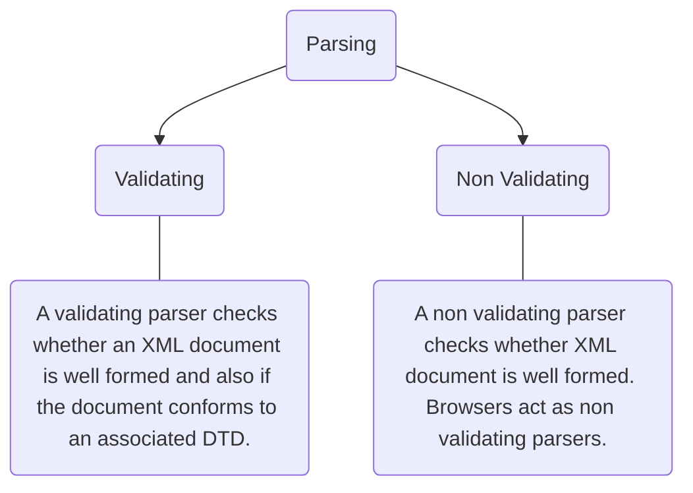
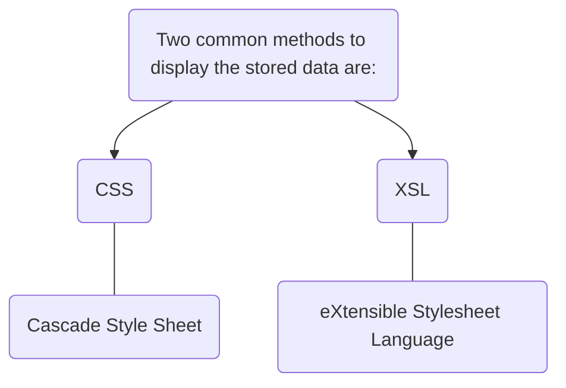
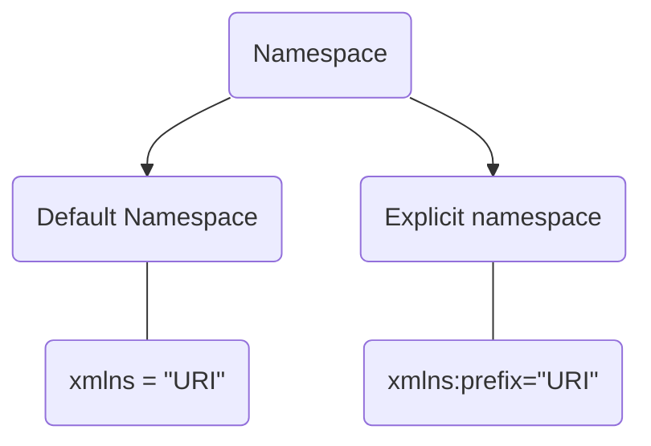
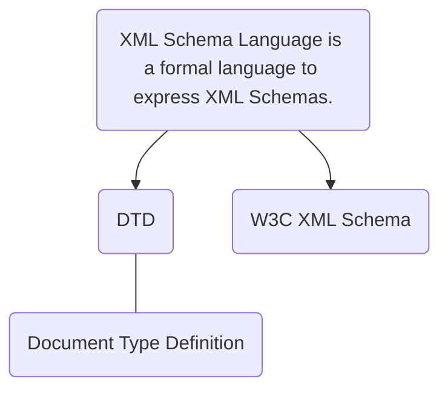
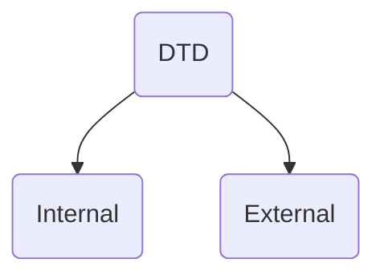
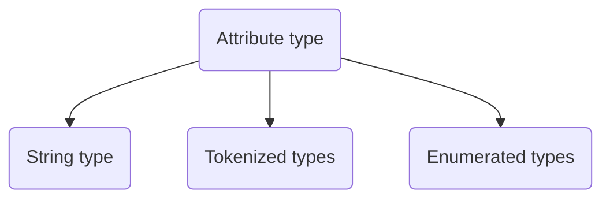
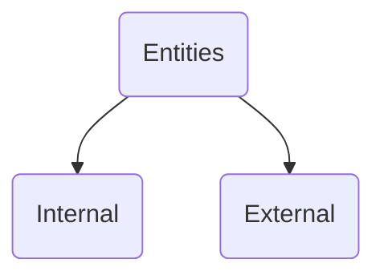
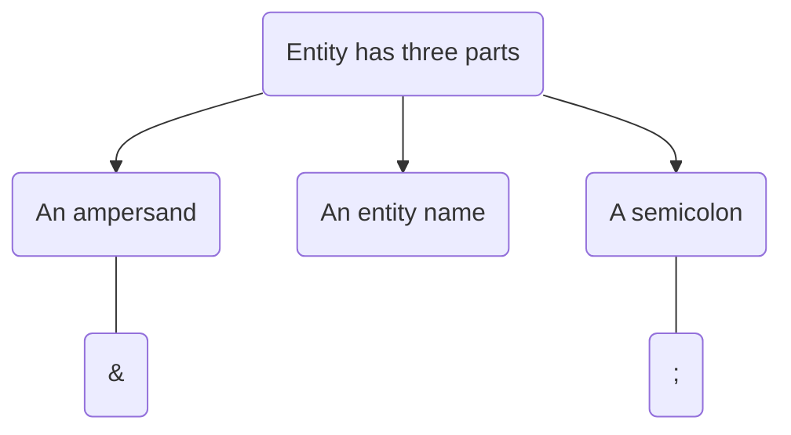
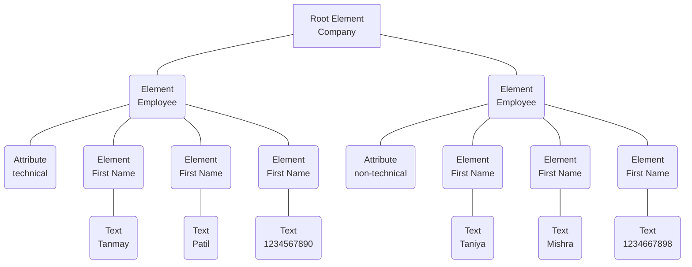
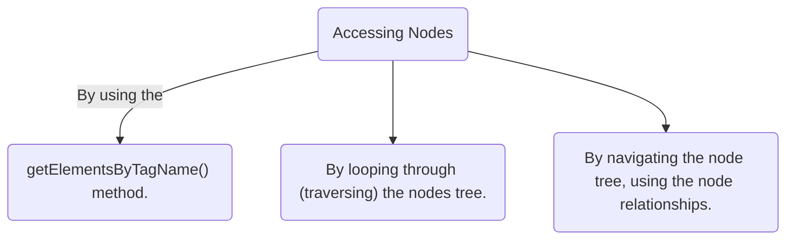

<< [Syllabus Module 3](m3_syllabus) |

# ❗❓ Info
Course Name: Internet Technologies
Course Code: CA220
Date: Saturday 15th October 2022
Professor/Speaker: *teach*
Tags: #xml

---
# 📑 XML

## 📃 Summary of Notes
- [❗❓ Info](#-info)
- [📑 XML](#-xml)
	- [📃 Summary of Notes](#-summary-of-notes)
- [**XML**](#xml)
	- [**XML vs HTML**](#xml-vs-html)
	- [**XML Structure**](#xml-structure)
		- [**XML Syntax**](#xmlsyntax)
		- [**Prolog**](#prolog)
		- [**Body**](#body)
	- [**Well Formed**](#well-formed)
		- [**XML Rules**](#xml-rules)
	- [**XML Example**](#xml-example)
	- [**XML Declaration**](#xml-declaration)
	- [**XML Element**](#xml-element)
	- [**Naming Rules**](#naming-rules)
	- [**Empty Elements**](#empty-elements)
	- [**XML Attributes**](#xml-attributes)
	- [**Parsing**](#parsing)
	- [**XML Special Characters**](#xml-special-characters)
	- [**Elements vs Attributes**](#elements-vs-attributes)
	- [**Displaying XML**](#displaying-xml)
	- [**XML Namespaces**](#xml-namespaces)
		- [**xmlns Attribute**](#xmlns-attribute)
	- [**XML Schema Languages**](#xml-schema-languages)
	- [**XML Validation**](#xml-validation)
- [**DTD**](#dtd)
	- [**Internal DTD**](#internal-dtd)
	- [**External DTD**](#external-dtd)
	- [**Declaring Elements in DTD**](#declaring-elements-in-dtd)
	- [**XML CDATA Sections**](#xml-cdata-sections)
		- [**CDATA Rules**](#cdata-rules)
	- [**PCDATA**](#pcdata)
	- [**DTD Attributes**](#dtd-attributes)
	- [**Entities**](#entities)
	- [**DTD Mixed Content**](#dtd-mixed-content)
	- [**XML DOM**](#xml-dom)
		- [**XML DOM Nodes**](#xml-dom-nodes)
		- [**XML Nodes Types**](#xml-nodes-types)
		- [**Node Parents, Children, and Siblings**](#node-parents-children-and-siblings)
	- [**First Child \& Last Child**](#first-child--last-child)
		- [**Accessing Nodes**](#accessing-nodes)
	- [**JAVA and DOM** (*note: I didn't get this one have to lean about this.*)](#java-and-dom-note-i-didnt-get-this-one-have-to-lean-about-this)
---
# **XML**
- XML *stands for* **[[xml|eXtensible Markup Language]]**.
- XML is a **markup language** much like HTML.
- XML was designed to **store** and **transport data**.
- a software and hardware independent way of storing, transporting, and sharing data.

## **XML vs HTML**
| **XML**                                                                                                                 | **HTML**                                                          |
| ----------------------------------------------------------------------------------------------------------------------- | ----------------------------------------------------------------- |
| XML is a **software and hardware independent tool** used to _transport and store data_. It ==focuses on what data is==. | HTML is used to **display data** and _focuses on how data looks_. |
| Case sensitive.                                                                                                         | Case insensitive.                                                 |
| You can defines your own tags.                                                                                          | Predefined tags.                                                  |
| Mandatory to use a closing tag.                                                                                         | Not necessary to use a closing tag.                               |
| It is **dynamic** because it is used to _transport data_.                                                               | It is **static** because it is used to _display data_.            |
| It **Preserve whitespaces**.                                                                                            | It does **not** _preserve whitespaces_.                           |

## **XML Structure**
- XML documents are *formed as element trees*.
- An XML tree starts at a **root element** and *branches from the root to child elements*. 
- All elements can have *sub elements* (==child elements==).

### **XML Syntax**
```xml
<root>
  <child>
    <subchild>...</subchild>
  </child>
</root>
```


- XML Document consists of:
	1) [Prolog](#Prolog)
	2) [Body](#Body)

### **Prolog**
- The prolog consists of an [XML declaration](#declaration).
- This line is called the XML **prolog**:-
```xml
	<?xml version="1.0" encoding="UTF-8"?>
```
- The XML prolog is ***optional***. ==If it exists, it must *come first* in the document==.
- XML documents can *contain international characters*
	- Example: Norwegian **øæå** or French **êèé**.

### **Body**
- This portion of the XML document *contains textual data marked up by tags*.
- It must have *one element* called the **document element or root element**, which ==defines the content in the XML document==.

---
## **Well Formed**
- An XML document is called well-formed if it satisfies certain [rules](#XML-Rules), *specified by the W3C*.

### **XML Rules**
- XML **documents** *must have a* **root element**.
- XML **elements** *must have a* **closing tag**.
- XML **tags** are **case sensitive**.
- XML **elements** *must be* **properly nested**.
- XML **attribute** *values must be* **quoted**.
- All **empty elements** *must be* **closed**.

---
## **XML Example**
- XML documents *begin with a XML [declaration](#XML-Declaration)* ==which is optional==.
```xml
<?xml version="1.0" encoding="UTF-8" ?>
<library>
	<book>
		<title>Atomic Habits</title>
		<author>James Clear</author>
		<genre>Self-help</genre>
		<publisher>Penguin Random House</publisher>
		<price>$14.99</price>
	</book>
	<book>
		<title>Rich Dad, Poor Dad</title>
		<author>Robert Kiyosaki, Sharon Lechter</author>
		<genre>Personal finance, Non-fiction</genre>
		<publisher>Warner Books</publisher>
		<price>$8.99</price>
	</book>
</library>
```

---
## **XML Declaration**
```xml
	<?xml version="1.0" encoding="UTF-8" ?standalone=”yes”>
```
- **version** - *simply* ==XML Version==.
- **encoding** - It designates the character set used by the XML document. 
					- ISO-8859-1 *(English and many Western European languages)*
- **standalone** - It defines whether a document requires a **[Document Type Definition](#DTD)**(defines the elements and attributes that can be used in a document).

---
## **XML Element**
- An XML element is everything from (*including*) the **element's start tag** to (*including*) the **element's end tag**.
- *Information contained within the tags* is called **content**.
- An element can contain: 
	- text
	- attributes 
	- other elements
	- or a mix of the above.


---
## **Naming Rules**
- Names can only contain **letters, digits and some other [special characters](#XML-Special-Characters)**.
- **Cannot start** with a *number or punctuation marks*.
- Must **not contain** the string “*xml*”,”*XML*” or “*Xml*”
- ==Cannot contain whitespace==.

---
## **Empty Elements**
- Empty Elements ***don’t have any content***.
- Can have *attributes*.
- **Must have a closing tag**

---
## **XML Attributes**
- Attributes are designed to **contain data** *related to a specific element*.
- They are *placed before the closing bracket* of the **starting tag**.
- example: here **date="2008-01-10"** is the attribute.
```xml
	<note date="2008-01-10">
		<to>Steve</to>
		<from>John</from>
	</note> 
```

---
## **Parsing**
- A parser is *used to check whether a document* is [Well Formed](#Well-Formed).
- There are 2 types of parsing:


---
## **XML Special Characters**

| **Symbol (name)**              	| **Escape Sequence** 	|
|--------------------------------	|---------------------	|
| < (less-than)                  	| `&#60;` or `&lt;`   	|
| > (greater-than)               	| `&#62;` or `&gt;`   	|
| & (ampersand)                  	| `&#38;`             	|
| ' (apostrophe or single quote) 	| `&#39;`             	|
| " (double-quote)               	| `&#34;`             	|

---
## **Elements vs Attributes**
| **Elements**                                                                                                  	    | **Attributes**                                                                                          	    |
|---------------------------------------------------------------------------------------------------------------	|---------------------------------------------------------------------------------------------------------	|
| They are the **main building blocks** of _both XML and HTML_ documents.                                       	        | They provide **extra information** _about elements_.                                                    	    |
| They contain text, other elements, or can be empty.                                                           	| Attributes are always placed inside the opening tag of an element.                                      	|
| ```<person> 	<gender>female</gender> 		<firstname>Rias</firstname> 		<lastname>Gremory</lastname> </person>``` 	    | ```<person gender = "female"> 	<firstname>Rias</firstname> 	<lastname>Gremory</lastname> </person>``` 	        |

*and if you are looking for which is the best please visit here:* https://stackoverflow.com/a/25764306

---
## **Displaying XML**
- XML documents do not carry information on how to display data.
- Raw XML files can be viewed in all major browsers.


---
## **XML Namespaces**
- A Namespace is a **set of unique names**. 
- Namespace is a mechanisms by which *element and attribute* ==name can be assigned to a group==. 
- The Namespace *is identified by [[URI|URI]]* (**Uniform Resource Identifier**).
- *In short*: XML Namespaces provide a method to **avoid element name conflicts**.
- Syntax:
```xml
<element xmlns:name = "URL">
```

### **xmlns Attribute**
- When using *prefixes* in XML, a **namespace** for the *prefix must be defined*.
- The namespace can be defined by an **xmlns** attribute in the start tag of an element. 

- for an example we wanna add 2 tables in one.
- table 1
```xml
<trip>
	<class>
		<students>
			<name>Astro Boy</name>
			<name>Saitama</name>
			<name>Makima</name>
			<name>Kyouma Hououin</name>
			<name>Gon Freecss</name>
		</students>
	</class>
</trip>
```

- table 2
```xml
<trip>
	<class>
		<students>
			<name>Kurisu Makise</name>
			<name>Levi Ackerman</name>
			<name>Fubuki</name>
			<name>Gintoki</name>
			<name>Arsène Lupin III</name>
			<name>Akeno Himejima</name>
		</students>
	</class>
</trip>
```

- Solving the Name Conflict Using a Prefix & an xmlns Attribute-
```xml
<root
	xmlns:a="https://www.class1.com"
	xmlns:b="https://www.class2.com">
	<a:trip>
		<a:class>
			<a:students>
				<a:name>Astro Boy</a:name>
				<a:name>Saitama</a:name>
				<a:name>Makima</a:name>
				<a:name>Kyouma Hououin</a:name>
				<a:name>Gon Freecss</a:name>
			</a:students>
		</a:class>
	</a:trip>
	<b:trip>
		<b:class>
			<b:students>
				<b:name>Kurisu Makise</b:name>
				<b:name>Levi Ackerman</b:name>
				<b:name>Fubuki</b:name>
				<b:name>Gintoki</b:name>
				<b:name>Arsène Lupin III</b:name>
				<b:name>Akeno Himejima</b:name>
			</b:students>
		</b:class>
	</b:trip>
</root>
```




1. Default Namespaces
	- Defining a default namespace for an element ***saves us from using prefixes in all the child elements***.
	- For the *entire document* ==xmlns attribute is put in the root element==.
	- Example: *(It can also apply a namespace to a particular element.)*
```xml
<BOOK xmlns="urn:example.microsoft.com:BookInfo"> 
	<TITLE>Creepy Crawlies</TITLE> 
	<PRICE currency="US Dollar">22.95</PRICE> 
</BOOK>
```

2. Explicit Namespaces
	- This is similar to default namespace, Except a prefix is associated with the xmlns attribute.
	- Example:
```xml
<BOOKS>  
  <bk:BOOK xmlns:bk="urn:example.microsoft.com:BookInfo"  
           xmlns:money="urn:Finance:Money">  
    <bk:TITLE>Creepy Crawlies</bk:TITLE>  
    <bk:PRICE money:currency="US Dollar">22.95</bk:PRICE>  
  </bk:BOOK>  
</BOOKS>
```

---
## **XML Schema Languages**
- An XML Schema describes the **structure of an XML document**.
- The purpose of an XML Schema is to define the *legal building blocks of an XML document*:
	- The **elements and attributes** that *can appear in a document*.
	- The *number of* (and order of) **child elements**.
	- **Data types** for *elements and attributes*.



---
## **XML Validation**
- An XML document with *correct syntax* is called "**Well Formed**".
- A *well formed XML document* can be **validated against DTD** or **Schema**.

---

# **DTD**
- DTD *stands for* (**Document Type Definition**).
- DTD defines the *structure* and the **legal elements and attributes** of an XML document.
- `<!DOCTYPE>` tag is used to **create a DTD**.
- Syntax:
```xml
<!DOCTYPE root_element [element_declarations]>
```

- DTD are of 2 types:


## **Internal DTD**
- It is defined **within a XML document**.
- `<!DOCTYPE>` tag is placed after the *declaration in internal dtd*.
- *Advantage of internal dtd* is that ==document is validated by itself **without external reference**==.
- Example:
```xml
<?xml version="1.0"?>  
<!DOCTYPE note [  
<!ELEMENT note (to,from,heading,body)>  
<!ELEMENT to (#PCDATA)>  
<!ELEMENT from (#PCDATA)>  
<!ELEMENT heading (#PCDATA)>  
<!ELEMENT body (#PCDATA)>  
]>  
<note>  
	<to>Tove</to>  
	<from>Jani</from>  
	<heading>Reminder</heading>  
	<body>Don't forget me this weekend</body>  
</note>
```
- The DTD above is interpreted like this:
	1. **!DOCTYPE note** defines that the *root element of this document* is **note**.
	2. **!ELEMENT note** defines that the *note element must contain four elements:* "**to,from,heading,body**".
		1. **!ELEMENT to** defines the *to element* to be of type "**#PCDATA**"
		2. **!ELEMENT from** defines the *from element* to be of type "**#PCDATA**"
		3. **!ELEMENT heading** defines the *heading element* to be of type "**#PCDATA**"
		4. **!ELEMENT body** defines the *body element* to be of type "**#PCDATA**"

## **External DTD**
- It is written in a *separate file* (**with `.dtd` extension**) and later this *file linked to a XML document*.
- It can be *linked to several XML documents* hence **reusable**.
- If we *need to make any changes in the DTD* they are made **just once**.
- *Reduces the size* of the XML document.
-  Example:
1. note.xml
```xml
<?xml version="1.0"?>  
<!DOCTYPE note SYSTEM "note.dtd">  
<note>  
  <to>Tove</to>  
  <from>Jani</from>  
  <heading>Reminder</heading>  
  <body>Don't forget me this weekend!</body>  
</note>
```
2. note.dtd
```dtd
<!ELEMENT note (to,from,heading,body)>  
<!ELEMENT to (#PCDATA)>  
<!ELEMENT from (#PCDATA)>  
<!ELEMENT heading (#PCDATA)>  
<!ELEMENT body (#PCDATA)>
```

---
## **Declaring Elements in DTD**
- Syntax: 
```dtd
<!ELEMENT name content>
```

| **name**                                	            | **Syntax**                                                                                	            |
|--------------------------------------------------	|-----------------------------------------------------------------------------------------------------	|
| Empty Elements                                   	| `<!ELEMENT element-name category>` or `<!ELEMENT element-name (element-content)>`   	                            |
| Elements with Parsed Character Data              	| `<!ELEMENT element-name (#PCDATA)>`                                                         	            |
| Elements with any Contents                       	| `<!ELEMENT element-name ANY>`                                                               	            |
| Elements with Children (sequences)               	| `<!ELEMENT element-name (child1)>` or `<!ELEMENT element-name (child1,child2,...)>` 	                            |
| Declaring Only One Occurrence of an Element      	| `<!ELEMENT element-name (child-name)>`                                                      	            |
| Declaring Minimum One Occurrence of an Element   	| `<!ELEMENT element-name (child-name+)>`                                                     	            |
| Declaring Zero or More Occurrences of an Element 	| `<!ELEMENT element-name (child-name*)>`                                                     	            |
| Declaring Zero or One Occurrences of an Element  	| `<!ELEMENT element-name (child-name?)>`                                                     	            |
| Declaring either/or Content                      	| `<!ELEMENT note (to,from,header,(message\|body))>`                                       	                |
| Declaring Mixed Content                          	| `<!ELEMENT note (#PCDATA\|to\|from\|header\|message)*>`                                     	                |

- Symbols for *defining content* in *element declarations*.

| **Symbol** 	    | **Meaning**                                                      	    |
|------------	|------------------------------------------------------------------	|
| ,          	| _Determines the sequence_ in which **elements must appear**.     	    |
| +          	| Requires that **atleast one instance** of _element be included_. 	    |
| ?          	| Allows **zero or one instance** of _an element_.                 	    |
| *          	| Allows **zero or more instance** of _an element_.                	    |
| !          	| Allows _one element_ from **group of elements to be included**.  	    |

---
## **XML CDATA Sections**
- CDATA means ***Character Data***.
- It means that the *data in between these strings* ==includes data== that _could_ ==be interpreted as XML markup, but should not be==.
- The predefined entities such as `&lt;`, `&gt;`, and `&amp;` require *typing and are generally difficult to read in the markup*. In such cases, CDATA section can be used.
- By using CDATA section, you are *commanding the parser that the particular section of the document contains **no markup*** and ==should be treated as regular text==.
- Syntax:
```xml
<![CDATA[
   characters with markup
]]>
```
- *CDATA Start section* − CDATA begins with the *nine-character delimiter* `<![CDATA[`.
- *CDATA End section* − CDATA section ends with `]]>` *delimiter*.
- *CDATA section* − 
	- Characters between these two enclosures are *interpreted as characters, and not as markup*. 
	- This section may contain markup characters **(<, >, and &**), *but they are ignored by the XML processo*r.
- Example: (In this ex, everything between `<message>` and `</message>` i*s treated as character data and not as markup*.)
```xml
<script>
   <![CDATA[
      <message> Welcome to TutorialsPoint </message>
   ]] >
</script >
```

### **CDATA Rules**
- CDATA *cannot contain the string* "**]]>**" anywhere in the XML document.
- *Nesting is not allowed* in CDATA section.

---
## **PCDATA**
- PCDATA *stands for* (**Parsed Character Data**).
- XML documents are *read and processed by a specific piece of software* called an **XML parser**.
- *PCDATA* is the ***text that will be parsed by a parser***.
- **Tags inside** the PCDATA will be **treated as markup and entities will be expanded**.
- *In other words* you can say that a PCDATA means the *XML parser examine the data and ensure that it doesn't contain entity if it contains that will be replaced*.

---
## **DTD Attributes**
- Attributes are declared with an *ATTLIST declaration*.
- When declaring attributes, you can specify *how the processor should handle the data that appears in the value*.



- Syntax:
```dtd
<!ATTLIST element-name attribute-name attribute-type attribute-value>
```
- In above Syntax:
	1. The DTD attributes `<!ATTLIST` keyword if the *element contains the attribute*.
		1. **element-name** specifies the *name of the element* ==to which the attribute applies==.
		2. **attribute-name** specifies the *name of the attribute* ==which is included with the element-name==.
		3. **attribute-type** defines the *type of attributes*.
		4. **attribute-value** *takes a fixed value that the attributes must define*.
- example
1. dtd file
```dtd
<!ATTLIST payment type CDATA "check">
```
2. xml file
```xml
<payment type="check" />
```

- The **attribute-type** can be one of the following:

| **Type**       	| **Description**                               	|
|----------------	|-----------------------------------------------	|
| CDATA          	| The value is character data                   	|
| (en1\|en2\|..) 	| The value must be one from an enumerated (It allows defining a specific list of values where one of the values must match. It is an Enumerated Attribute Type.) list 	|
| ID             	| The value is a unique id                      	|
| IDREF          	| The value is the id of another element        	|
| IDREFS         	| The value is a list of other ids              	|
| NMTOKEN        	| The value is a valid XML name                 	|
| NMTOKENS       	| The value is a list of valid XML names        	|
| ENTITY         	| The value is an entity                        	|
| ENTITIES       	| The value is a list of entities               	|
| NOTATION       	| The value is a name of a notation             	|
| xml:           	| The value is a predefined xml value           	|

- The **attribute-value** can be one of the following:

| Value        	| Explanation                        	|
|--------------	|------------------------------------	|
| `value`        	| The default value of the attribute 	|
| `#REQUIRED`    	| The attribute is required             |
| `#IMPLIED`     	| The attribute is optional             |
| `#FIXED value` 	| The attribute value is fixed          |

## **Entities**
- Entities are used to *define shortcuts to special characters*.
- Entities can be *declared:*


- Internal Entity Declaration:
	- Syntax: 
```dtd
<!ENTITY entity-name "entity-value">
```
- Example:
1. dtd file
```dtd
<!ENTITY writer "Donald Duck.">
<!ENTITY copyright "Copyright W3Schools.">
```
2. xml file
```xml
<author>&writer;&copyright;</author>
```



- External Entity Declaration::
	- Syntax: 
```dtd
<!ENTITY entity-name SYSTEM "URI/URL">
```
- Example:
1. dtd file
```dtd
<!ENTITY writer SYSTEM
"https://www.w3schools.com/entities.dtd">
<!ENTITY copyright SYSTEM
"https://www.w3schools.com/entities.dtd">
```
2. xml file
```xml
<author>&writer;&copyright;</author>
```

---
## **DTD Mixed Content**
- For an element that can contain both PCDATA and other elements use the _#PCDATA_, "`|`" and "`*`" *signs in combination*. 
- The *above mentioned combination can be used to declare* that an element can contain *zero or more occurrences* of ==either/or element and PCDATA==.
```xml
<!ELEMENT elementname (#PCDATA|child1|child2)*>
```
1. **ELEMENT** is the *element declaration tag*.
2. **elementname** is the *name of the element*.
3. **PCDATA** is the text that *is not markup*. `#PCDATA` *must come first in the mixed content declaration*.
	1. _child1, child2.._ are the ==elements and each element must have its own definition within the DTD==.
	2. The operator (`*`) must follow the *mixed content declaration if children elements are included*.
	3. The (*#PCDATA*) and *children element declarations must be separated* by the (|) operator.

---
## **XML DOM**
- DOM *stands for* (**Document Object Model**).
- It defines a *standard for accessing and manipulating documents*.
- It defines the *logical structure of documents* and the ==way a document is accessed and manipulated==.
- Provides a *standard programming interface* that ==can be used in a wide variety of environments and applications==. 
- The DOM can be *used with any programming language*.
- XML DOM defines a *standard way to access and The XML DOM makes a tree-structure view for an XML document*.
```xml
<?xml version = "1.0"?>
<Company>
	<Employee category = "technical">
		<FirstName>Tanmay</FirstName>
		<LastName>Patil</LastName>
		<ContactNo>1234567890</ContactNo>
	</Employee>
	<Employee category = "non-technical">
		<FirstName>Taniya</FirstName>
		<LastName>Mishra</LastName>
		<ContactNo>1234667898</ContactNo>
	</Employee>
</Company>
```

- Output-


### **XML DOM Nodes**
- According to the XML DOM, *everything in an XML document* is a **node**:
	- The **entire document is a document node**.
	- *Every XML element* is an **element node**.
	- The *text in the XML elements* are **text nodes**.
	- *Every attribute is an* **attribute node**.
	- *Comments are* **comment nodes**.

### **XML Nodes Types**
| Node Types                   	| Explanation                                                                                                                   	|
|------------------------------	|-------------------------------------------------------------------------------------------------------------------------------	|
| CData Node                   	| This *node contains information* that should **not be analyzed by the parser**. Instead, it should *just be passed on as plain text*. 	|
| Comment Node                 	| This *node includes information* about the **data, and is usually ignored by the application**.                                     	|
| Processing Instructions Node 	| This *node contains information* **specifically aimed at the application**.                                                         	|
| Document Fragments Node      	| Represents the **root** of *any sub tree*.                                                                                          	|
| Entities Node                	| *Parsed or Unparsed entity*.                                                                                                    	|

### **Node Parents, Children, and Siblings**
- The nodes in *the node tree have a **hierarchical relationship** to each other*.
- The terms *parent, child, and sibling* are used to **describe the relationships**. 
- **Parent nodes** *have children*. *Children on the same level* are called **siblings** (*brothers or sisters*).
- In **a node tree**, *the top node* is called the **root**.
- *Every node, except the root*, **has exactly one parent node**.
- *A node* can have **any number of children**.
- A *leaf is a node with no children*.
- **Siblings are nodes** *with the same parent*.


---
## **First Child & Last Child**
```xml
<bookstore>
	<book category="cooking">
		<title lang="en">Everyday Italian</title>
		<author>Giada De Laurentiis</author>
		<year>2005</year>
		<price>30.00</price>
	</book>
</bookstore>
```
- In the XML above:
	1. The `<title>` element is the **first child** of the `<book>` element, and the `<price>` *element is the last child of* the `<book>` element.
	2. *Furthermore,* the `<book>` element is the **parent node** of the `<title>`, `<author>`, `<year>`, and `<price>` elements.

### **Accessing Nodes**



---
## **JAVA and DOM** (*note: I didn't get this one have to lean about this.*)
- **Instantiate XML file:** DOM parser loads the XML file into memory and consider every tag as an element.
- **Get root node:** Document class provides the getDocumentElement() method to get the root node and the element of the XML file.
- **Get all nodes:** The `getElementByTagName()` method retrieves all the specific tag name  from the XML file. Where `ELEMENT_NODE` type refers to a non-text node which has sub-elements. If we need to access all nodes from the starting, including the root node, we can recursively call the `getChildElement()` method.
- **Get Node by text value:** We can use `getElementByTextValue()` method in order to search for a node by its value.
- **Get Node by attribute value:** 
---