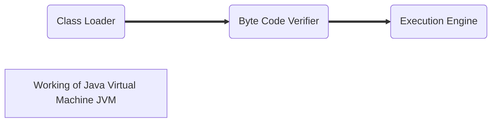

<< [[2022-09-20]] | [[2022-09-22.md]] >>

# ❗❓ Info
Course Name: 
Date: Tuesday 20th September 2022
Professor/Speaker: 
Tags: #homework #h/w 

---
# 📑 H/W

## 📃 Summary of Notes
1. [Explain Java Features.](#1)
2. [Explain JVM.](#2)
3. [What is Byte Code.](#3)
4. [Is Java platform-indipendent? (comment onto it)](#4)
5. [Java Program Syntax. (With Explanation.)](#5)
6. [Discuss Structure of Java Program.](#6)
7. [Differnet types of Java Tokens. (With Examples.)](#7)
8. [Differnece between Primitive vs Reference Data Types.](#8)
9. [Exaplin Differnet Data Types in Java.](#9)
10. [Differnece between Primitive vs Refernce Data Types.](#10)
11. [How do you declare constants in Java. (With Examples.)](#11)
12. [How we declare and create Arrays.](#12)
13. [Write a Program in Java to perform following :-](#13)
	i) [Linear searching of an element in an array of Size 'a'.](#13.1)
	ii) [Finding the smallest and largest element in array.](#13.2)
	iii) [Find Average of all elements in the array.](#13.3)
14. [Differnece between-](#14)
	i) [Break and continue Statment.](#14.1)
	ii) [Labelled & Unlabelled break Statment.](#14.2)
	iii) [Switch Case & If Else Ladder.](#14.3)
	iv) [All Loops. (with Syntax & Examples.)](#14.4)
15. [Multi-Dimentional Array](#15)
16. [Write a Program of a 2D Array to find the Row MAX & Column MAX.](#16)
17. [Bit-wsie Operators](#17)
18. [-MOD3-](#18)
	1. [Method Overlapping.](#18.1)
	2. [How do we create methods? How many ways can a arguments be passed to methods in Java?](#18.2)
	3. [Differnece between Class & Objects.](#18.3)
	4. [Scope of variables (Instance local stataic).](#18.4)
	5. [How to create Enum in Java](#18.5)


## **Answers-**

# 1
  - Q1. *Explain Java Features.*
  - # **ans-**
	  - ## **Platform Independent** -
		  - *Compiler converts source code* to **bytecode** and then the *[JVM](#JVM) executes the bytecode* generated by the compiler.
		  - This **bytcode** can run on any device. Each OS has a *different [JVM](#JVM)*, but the ==output produced by all the OS is the same after the execution of bytecode==.
		  - This is why Java is called **platform-independent**. 
			  - The programs written in Java *can be run on multiple platforms* *without re-writing them individually* for a particular platform.

	  - ## **Simple** -
		  - It is one of the ***easy-to-use*** programming languages *to learn*.
		  - Java's syntax is based on "*C++*" (*so easier for programmers to learn it after C++*).
		  - Java has **removed** many *complicated and rarely-used features*, 
			  - *Example-* explicit pointers, operator overloading, *etc.*
		- There is *no need* to r==emove unreferenced objects== because there is an **Automatic Garbage Collection in Java**.

	  - ## **Object-oriented** -
		  - *Everything in Java* is an **object**. 
		  - Object-oriented means *we organize our software* as a ==combination of different types of objects that incorporate both data and behavior==.
			  - Basic concepts of OOPs are:
				  1. [[Object_Oriented_Programming#^edbd1a|Object]]
				  1. [[Object_Oriented_Programming#^3ccd44|Class]]
				  2. Inheritance
				  3. Polymorphism
				  4. Abstraction
				  5. Encapsulation

	  - ## **Secured** -
		  - Java is best known for its *security*. With Java, we can develop *virus-free systems*. 
		  - Java programs run in an environment that is *independent of the os environment* ==which makes java programs more secure==.
		  - Java is secured because:
			  - *No explicit pointer*.
			  - Java Programs run inside a *virtual machine sandbox*.

	  - ## **Robust** -
		  - Java is a robust language that *can handle run-time errors as it checks* the code *during the compile and runtime*.
		  - If any *runtime error* is identified by the *JVM*, it will **not be passed directly** to the *underlying system*. Instead, it will *immediately* **terminate the program** and ==stop it from causing any harm to the system==.
		  - The *main features* of java that make it robust are **garbage collection, Exception Handling, and memory allocation**.

	  - ## **Portable** -
		  - *Java Byte code* can be **carried to any platform**, ==It doesn't require any implementation==.
		  - *Example-* Size of primitive data types.

	  - ## **High Performance** -
		  - Java is an *interpreted language*, so ==it will never be as fast as a compiled language like C or C++==. But, *Java enables high performance* with the use of **just-in-time compiler**.

	  - ## **Distributed** -
		  - Java is *designed for the distributed environment of the internet*.
		  - Java has a *special class library* for *communicating using TCP/IP protocols*. ==Creating network connections is very much easy in Java as compared to C/C++==.

# 2
  - Q2. *Explain JVM.*
  - # **ans-**
		  - JVM *stands for* **Java Virtual Machine**.
		  - **A specification** that specifies the *working of Java Virtual Machine*. JVM is an *abstract machine responsible for* **compiling** and **executing the Java code**. 
		  - **An implementation** It is a part of the **Java Runtime Environment** (*JRE*) ==which calls the main function of a program==.
		  - **Runtime Instance** Whenever you write *java command on the command prompt* to ==run the java class, an instance of JVM is created==.
```mermaid
flowchart LR
    A[Runtime Instance] --  Source Code <br> '.java file' ---> B{Comipler <br> 'javac'} --  Byte Code <br> '.class file' --> D

    D --  JVM ---> E[Inerpeter for Mac]
    D --  JVM ---> F[Inerpeter for Windows]
    D --  JVM ---> G[Inerpeter for Linux]
```
		
## 	**What it does**
- The JVM performs following operation:
	- Loads code
	- Verifies code
	- Executes code
	- Provides runtime environment

	## **How JVM Works?** -
	- First, Java code is compiled into bytecode. This bytecode gets interpreted on different machines.
	- Between host system and Java source, Bytecode is an intermediary language.
	- JVM in Java is responsible for allocating memory space.


-


```mermaid
graph TB
	subgraph Working of JVM <br>
	    subgraph .
		    c1(Java Source) ==> id1([Java Compiler]) ==> C(Java Bytecode)
		end
		subgraph .
    
			b2[Java Virtual Machine]
			b3[Opearting System]
			b4[Hardware]
			
		    b1[Libraries] ==> b2
		    C ==> b2
    
		    b2 -.- b3 -.- b4
	    end
    end
```

