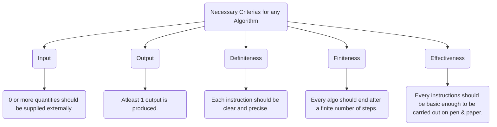
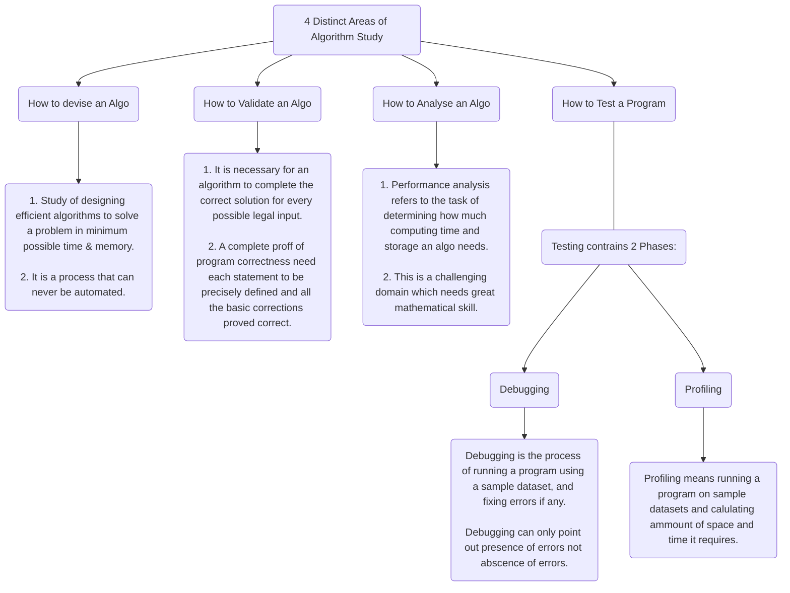

---
# 📑 Fundamentals of Computer Algorithms

---
# **Algorithm**
- An algorithm is a sequence of unambiguous instructions for solving a problem.
- "Algorithm" word ceoms from a persian author named [Abu Ja'far Muhammad ibn Musa al Khwarizmi](https://en.wikipedia.org/wiki/Muhammad_ibn_Musa_al-Khwarizmi).
-

- 


---
# **Asymptotic Notations:**
- These are mathematical notations used to describe the running time of an algorithm when the input tends towards a particular value or a limiting value.
- Three main notations are:
		- **Big-Oh Notation (O)**
			- It represents the upper bound of the running time of an algorithm.
			- Thus, it provides the worst case complexity of an algorithm.
			- image source: https://www.programiz.com/dsa/asymptotic-notations 
			- Here, f(n) <= c.g(n), c.g(n) proves to be the upper bound for f(n) for all n >= 0.
			- c = constant
			- n<sub>0</sub> >= 1
			- Therefore, f(n) = O(g(n))
		- **Big-Omega Notation (Ω)**
			- It represents the lower bound of the running time of an algorithm.
			- Thus, it provides the best case complexity of an algorithm.
			- image source: https://www.programiz.com/dsa/asymptotic-notations 
			- Here, f(n) >= c.g(n), c.g(n) proves to be the lower bound for f(n) for all n >= n<sub>0</sub>.
			- c = constant
			- c > 0
			- n<sub>0</sub> >= 1
			- Therfore, f(n) = Ω(g(n))
		- **Big-Theta Notation (Θ)**
			- Theta notation encloses the fundtion f(n) from above and below, It represents both upper and lower bound of the running time of an algorithm.
			- It is used to analyze the average case complexity of an algorithm.
			- image source: https://www.programiz.com/dsa/asymptotic-notations 
			- Here,  c<sub>2</sub>.g(n) <= f(n) <= c<sub>1</sub>.g(n), c<sub>1</sub>.g(n) & c<sub>2</sub>.g(n) proves to be the lower bound & upper bound for f(n) for all n >= n<sub>0</sub>.
			- c<sub>1</sub>, c<sub>2</sub> = constant
			- c<sub>1</sub>, c<sub>2</sub> > 0
			- n<sub>0</sub> >= 1
			- Therfore, f(n) = Θ(g(n))

---
# **Master Theorem**
- This theorm is used to solve recurrence relations of the form.
$${T(n) = \mathbf{aT} (\frac{n}{b}) + Θ(n^{k}log^{p}n)}$$
- where, a >= 1, b > 1, k >= 0, p = any real number
- **Case I:**
	- If a > b<sup>k</sup>, then
		- $${T(n) = Θ({n}^{log_{b}a})}$$
- - **Case II:**
	- If a = b<sup>k</sup>, then
		- If p > -1, then
			- $${T(n) = Θ({n}^{log_{b}a}{log^{p+1}n})}$$
		- If p = -1, then
			- $${T(n) = Θ({n}^{log_{b}a}{loglog n})}$$
		- If p < -1, then
			- $${T(n) = Θ({n}^{log_{b}a})}$$
- - **Case III:**
	- If a < b<sup>k</sup>, then
		- If p >= 0, then
			- $${T(n) = Θ({n}^{k}{log^{p}n})}$$
		- If p < 0, then
			- $${T(n) = Θ({n}^{k})}$$

---
# **Sorting Algorithms**

## **Selection Sort:**
- It is a simple sorting algorithm that works by selecting the *smallest element from the unsorted part of an array* and **putting it at the beginning of the array**. It then keeps repeating the process for the remaining unsorted part of the array until the whole array is sorted.
```java
for(int i=0; i<(5-1); i++){
    // initialize i to 0 and loop over the array until i is less than n-1
    for(int j=i+1; j<5; j++){
        // initialize j to i+1 and loop over the remaining unsorted part of the array until j is less than n
        if(arr[j] < arr[i]){
            // compare the value of the element at index j to the value of the element at index i
            int temp = arr[i];
            arr[j] = arr[i];
            arr[i] = temp;
            // if the element at index j is smaller than the element at index i, swap their positions in the array
        }
    }
}
```

### **Selection Sort Analysis**
- Time Complexity = **Θ(n<sup>2</sup>)** *{because of 2 nested loops}*
	- One loop to select an array's element one by one => **Θ(n)
	- Second loop to compare & swap elements => **Θ(n)
- Selection sort is an in-place sorting algorithm.
- Selection sort is not a stable algorithm.


## **Insertion Sort:**
- It is a simple sorting algorithm that works by *building a sorted list from the unsorted part of an array one element at a time*. It *iterates through the array and for each element*, it *finds the* **correct position to insert it in the sorted part of the array**.
```java
Algorithm Sort(int a[], int n){
    int i,j,key;
    // initialize i to 1 and loop over the array until i is less than n
    for(i = 1; i < n; i++){
        // set the variable key to the value of the element at index i
        key = a[i];
        // initialize j to i-1
        j = i - 1;
        // while j is greater than or equal to 0 and the value of the element at index j is greater than key
        while(j >= 0 && a[j] > key){
            // move the element at index j one position to the right
            a[j + 1] = a[j];
            // decrement j
            j = j - 1;
        }
        // set a[j+1] to key
        a[j + 1] = key;
    }
}
```

### **Insertion Sort Analysis**
- Time Complexity = **Θ(n<sup>2</sup>)** *{because of 2 nested loops}*
	- First "*for*" loop, for *comparing elements with their previous element*.
	- Second "*while*" loop, for *shifitng elements forward*.
- Insertion sort is an in-place sorting algorithm.
- Insertion sort is a stable algorithm.


## **Quick Sort:**
- It is a simple sorting algorithm that works by *building a sorted list from the unsorted part of an array one element at a time*. It *iterates through the array and for each element*, it *finds the* **correct position to insert it in the sorted part of the array**.
```java
Partition(arr[], lb, ub){
    int i,j,key;
    // initialize i to 1 and loop over the array until i is less than n
    for(i = 1; i < n; i++){
        // set the variable key to the value of the element at index i
        key = a[i];
        // initialize j to i-1
        j = i - 1;
        // while j is greater than or equal to 0 and the value of the element at index j is greater than key
        while(j >= 0 && a[j] > key){
            // move the element at index j one position to the right
            a[j + 1] = a[j];
            // decrement j
            j = j - 1;
        }
        // set a[j+1] to key
        a[j + 1] = key;
    }
}
```

### **Insertion Sort Analysis**
- Time Complexity = **Θ(n<sup>2</sup>)** *{because of 2 nested loops}*
	- First "*for*" loop, for *comparing elements with their previous element*.
	- Second "*while*" loop, for *shifitng elements forward*.
- Insertion sort is an in-place sorting algorithm.
- Insertion sort is a stable algorithm.