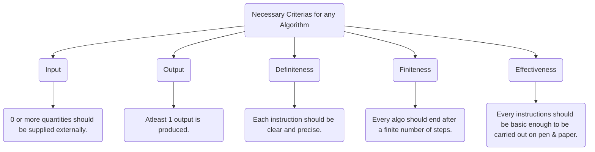
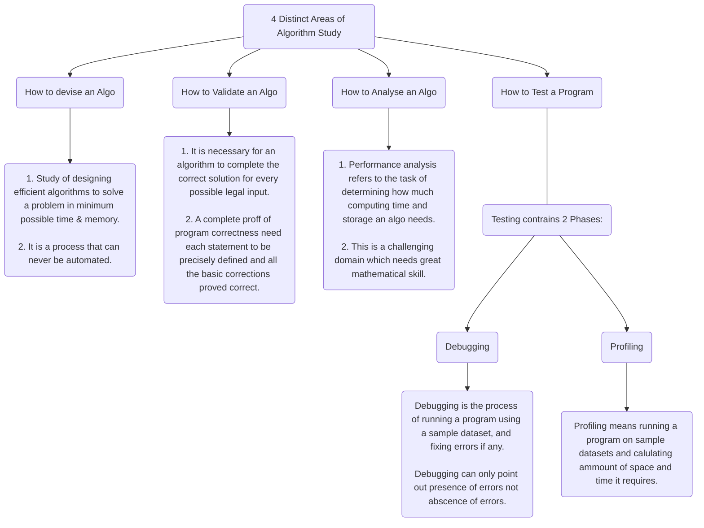

<< [[Sem_4/Fundamentals_of_Computer_Algorithms/Classes_Notes/Module_1/m1_syllabus|Syllabus Module 1]] | [[2022-12-05_Fundamentals_of_Computer_Algorithms|Fundamentals of Computer Algorithms]] >>

# ❗❓ Info
Course Name: Fundamentals of Computer Algorithms
Course Code: CA255
Date: Sunday 12th March 2023
Professor/Speaker: *self ig..*
Tags: #Fundamentals_of_Computer_Algorithms

---
# 📑 Fundamentals of Computer Algorithms

---
# **Algorithm**
- An algorithm is a sequence of unambiguous instructions for solving a problem.
- "Algorithm" word ceoms from a persian author named [Abu Ja'far Muhammad ibn Musa al Khwarizmi](https://en.wikipedia.org/wiki/Muhammad_ibn_Musa_al-Khwarizmi).
-

- 


# **Selection Sort:**
- It is a simple sorting algorithm that works by selecting the *smallest element from the unsorted part of an array* and **putting it at the beginning of the array**. It then keeps repeating the process for the remaining unsorted part of the array until the whole array is sorted.
```java
for(int i=0; i<(5-1); i++){
    // initialize i to 0 and loop over the array until i is less than n-1
    for(int j=i+1; j<5; j++){
        // initialize j to i+1 and loop over the remaining unsorted part of the array until j is less than n
        if(arr[j] < arr[i]){
            // compare the value of the element at index j to the value of the element at index i
            int temp = arr[i];
            arr[j] = arr[i];
            arr[i] = temp;
            // if the element at index j is smaller than the element at index i, swap their positions in the array
        }
    }
}
```

# **Asymptotic Notations:**
- These are mathematical notations used to describe the running time og an algorithm when the input tends towards a particular value or a limiting value.
- Three main notations are:
		- Big-O Notation (O)
			- It represents the upper bond of the running time of an algorithm
