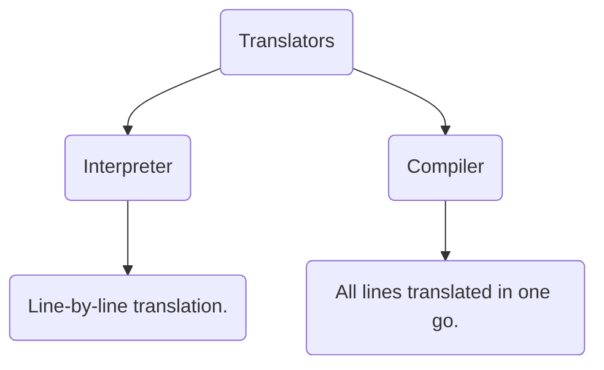
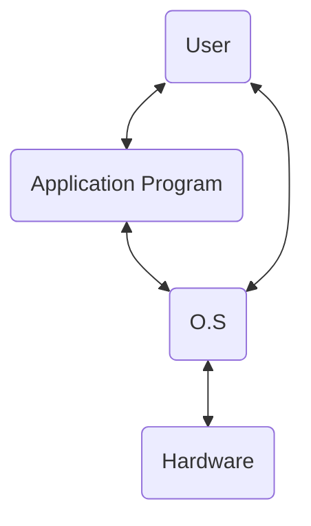

# ❗❓ Info
Course Name: Python Programming
Module: Module 1
Date: Saturday 19th August 2023
Professor/Speaker: 
Tags: #PythonProgramming #Module1 #IntroductionToPython

---
# 📑 Module 1: Introduction to Computers, Programs, and Python

# Python Basic
- High Level Language.
- Interpreted Language.
- General Purpose Programming Language.
- Case Sensitive.
- Object-Oriented Programming Language.
- Open Source.
- Dynamically Typed.

# Translators
- Translators *converts the source code* to **machine-code**.


---


# Roles of OS:
- **Controlling** & **Monitoring** *system activities*.
- **Allocating** & **Assigning** *system resources*.
- **Scheduling Operations**.

# Comments
- *Single-Line Comment*: 
```python
# This is a single line comment.
```
- *Multi-Line Comment:*
```python
"""  
This is a
Multi-line
comment.
"""
```

# Indentation
- ***Whitespace** at the start of the line* to **indicate a block of code**.

# Errors (SIRLogic)
- **S**yntax Error:
	- Error in **Code Construction**.
- **I**nput Error:
	- Causes when *User Enters a value* that the **Program Can't Handle**.
- **R**untime Error:
	- *Causes Program* to **Terminate Abnormally**.
- **Logic** Error:
	- Happens when a *Program Doesn't Perform* **the way it was Intended To**.

# Variable
- Variable is a name that **references a value stored in computer memory**.
- We don't need to declare data type of the variable.
- It automatically figures out the data type accordingly.

# Input from Console
```python
variable = input("Enter a Variable: ")
```
- By default, the `input()` function returns a **string**.
- We can use `eval()` function to dynamically evaluate expressions.
```python
a = eval(input("Enter a Number: "))
print(a)
```

# Identifiers
- Identifiers are like the names you give to things in your program, such as variables and functions.
## Naming Rule of Identifiers
1. Sequence of Char - letters, digits & underscore.
2. Should always start with letter or underscore.
3. Can't be a keyword (for ex: for, while, if, elif)
4. Can be of any length.

# Variable, Assignment Statement & Expression
- Variable are used to reference values that may be changed in the program.
- ex: Assignment Statement
```python
x = 10 # x -> 10 {x now holds the value 10}
y = x + 5 # y -> 15
x = 23 # x -> 23
y = x + 11 # y -> 34
```
`Variable = Expression`

- Assigning to Multiple Variable
```python
x = y = z = 2

print(x,y,z) # 2 2 2
```