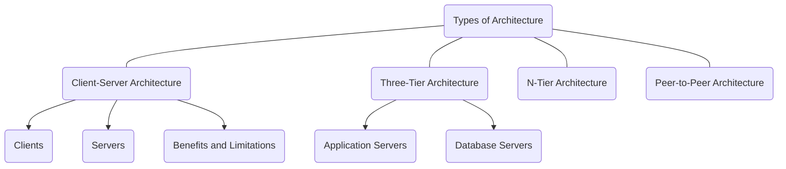

<< [DC Syllabus](Sem_6/Distributed_Computing/index.md) | [Module 2](Sem_6/Distributed_Computing/Notes/Module_2.md) >>

# ❗❓ Info
Course Name: Distributed Computing
Course Code: CA356
Date: Tuesday 16th January 2024
Professor/Speaker: 
Tags: #DC #M1

---
# 📃 Topics

# **some terms.. ;-;''**
- Early computers performed on single processor (*Uni-Processor or Monolithical Computing* which can be called as **Centralized Computing**)
- Independent computers are called **Loosely Coupled**.
- Service provided by a server on a network is called **Network Service**. 💀
- Application that runs on networked computers for end users.

---
# **Distributed System (DS) `?_?`**
- DS is a collection of independent computers, interconnected via network. Collaborating with each other to perform a task.
- It has no central point of failure – if one machine stops working DS will not be affected.
---
# **Distributed Computing (DC) `?_?`**
- In simple words, Using multiple computers work together to solve a common problem.
- It provides large-scale resources to deal with complex challenges.
	- for ex: 
		- DC can encrypt large volume of data.
		- Solve physics & chemical equations with many variables.
		- Render high quality 3D Video animations.
- *Some other terms that all refer to DC*:
	- Distributed Systems
	- Distributed Programming
	- Distributed Algorithms
## Advantages

| **Advantages** | Explanation                                                                                                                                                                       |
| -------------- | ---------------------------------------------------------------------------------------------------------------------------------------------------------------------- |
| *Scalability*  | As users needs grow, they **can add more computing power to the system**. |
| *Availability* | It can **continue to operate** *even if some system fails*.                                                                                                                                                                       |
| *Consistency*  | Information is **shared and duplicated across all parts of the system**, and the *system manages this data consistently*, *allowing you to avoid errors and ensure reliability*.                                                                                                                      |
| *Transparency* | Users can interact with the *system as if it were a single computer*, regardless of how many *physical machines are involved*. They can *use different types of hardware, software, and operating systems together*.                                                                                                                                                                       |
| *Efficiency*   | The system **uses resources efficiently**, providing **fast performance** and *reducing the risk of system failure* due to high demand or low usage of the hardware.                                                                                                                                                                       |

## Uses-Cases

---
## Architecture
- In DC, you design applications that can run on several computers instead of on just one computer.

### Types of Architecture

#### Client-Server Architecture
- Client-server is the most common method of software organization on a distributed system. The functions are separated into two categories: clients and servers.

| **Clients** | **Servers** | Benefits and limitations |
| ---- | ---- | ---- |
| Clients make requests to the servers, which manage most of the data and other resources. You can make requests to the client, and it communicates with the server on your behalf. | Server computers synchronize and manage access to resources. They respond to client requests with data or status information. Typically, one server can handle requests from several machines. | - Client-server architecture gives the benefits of security and ease of ongoing management. You have only to focus on securing the server computers. Similarly, any changes to the database systems require changes to the server only.  - The limitation of client-server architecture is that servers can cause communication bottlenecks, especially when several machines make requests simultaneously. |

#### Three-Tier Architecture
- In three-tier distributed systems, client machines remain as the first tier you access. Server machines, on the other hand, are further divided into two categories:

| **Application Servers**                                                                                                                                              | **Database Servers**                                                                                                                                                                                                                                                                              |
| -------------------------------------------------------------------------------------------------------------------------------------------------------------------- | ------------------------------------------------------------------------------------------------------------------------------------------------------------------------------------------------------------------------------------------------------------------------------------------------- |
| - Application servers act as the middle tier for communication. They contain the application logic or the core functions that you design the distributed system for. | - Database servers act as the third tier to store and manage the data. They are responsible for data retrieval and data consistency.  - By dividing server responsibility, three-tier distributed systems reduce communication bottlenecks and improve distributed computing performance. |

#### N-Tier Architecture
- N-tier models include several different client-server systems communicating with each other to solve the same problem. Most modern distributed systems use an n-tier architecture with different enterprise applications working together as one system behind the scenes.
#### Peer-to-Peer Architecture
- Peer-to-peer distributed systems assign equal responsibilities to all networked computers. There is no separation between client and server computers, and any computer can perform all responsibilities. 
- Peer-to-peer architecture has become popular for content sharing, file streaming, and blockchain networks.
