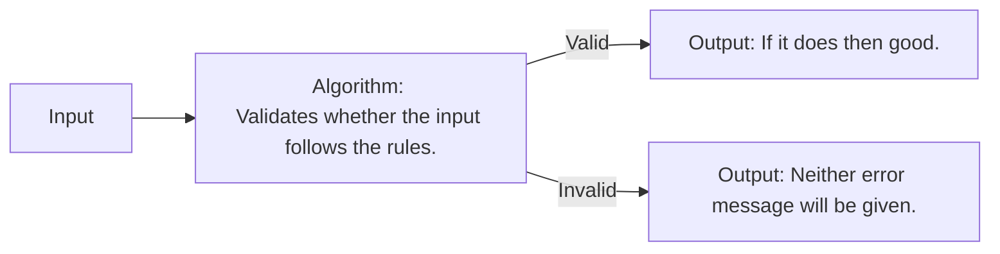

2024-09-07 10:18

Status: #ongoing

Tags: [[What-is-algorithm]]

# Algorithm Basics
Subject: [[Design and Analysis of Algorithms]]

An algorithm is a step-by-step procedure for solving a problem.

There is an **input**, and then there's an **algorithm**, *the algorithm is a set of rules* the program follows to produce the **output**.

---
# References