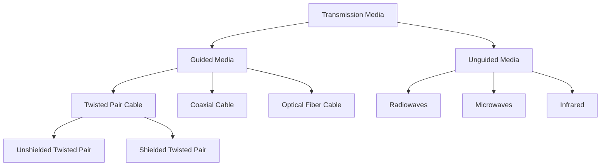

+2024-09-22 11:05

Status: #ongoing 

Tags: #Internet-Protocol

# 🌐 Internet and It's Protocols: The Building Blocks of Networking
Subject: [[Fundamentals of Computer Networking]]

Welcome to the foundation of our networking journey! In this section, we'll explore the core concepts that make the Internet tick.
## 🕸️ What is the Internet?

**The Internet** is like a **spider weaving its web**. Just as the spider spins an intricate complex silk strands to create an **interconnected web**, Internet is built upon **linking networks** together. Each **thread** in the web represents some kind of  **data connection** that ties devices, websites, and services into a vast complex network. These connections like the spider's web form a **hierarchical structure**, allowing information to flow between **nodes** (devices) efficiently, capturing and delivering **data** just as the spider’s web captures its prey, only thing is spider get's the final product every time unless someone else comes and snatches it, but in Internet it's always, one door to another like a delivery guy.

- No one **rules the Internet**—it’s a **decentralized system**. There’s no single guy at the top who is controlling all the data you see. _Why, you may ask?_ Because, just like the **Universe**, the web keeps **expanding every second**, it’s simply not feasible for any **one person or organization** to manage it all; **tons of data** are being uploaded and transferred across the web every moment.
- THO, the Internet operates using **standardized communication protocols**, which act like a **universal language**. Just as the language that you and me speak-write which allow us to communicate/understand our thoughts, just like that these protocols allows data to be transferred reliably between **millions of systems around the world**, *even without centralized control*.
	- *For example*: A key protocol is "**TCP/IP**" it's job is to ensure that all the devices, services and networks can communicate smoothly and efficiently with each other, no matter where they are.

## 📡 The Network Edge

This is where **all the action happens**—it's the point where our devices connect to a larger network. Think of it as your phone or any device reaching out to join the digital world, just like stepping out of your house to meet your neighbours' next door. 

### Access Networks

These are the "***last mile***" connections that bring the Internet to our doorstep.

1. **DSL (Digital Subscriber Line)**: This uses phone lines, It’s not the fastest method, but it’s like having a reliable old car—gets you where you need to go, *just not in a rush*.
    
2. **Cable**: Remember the days of **cable TV**? ahh good old days sitting on the bed/couch, watching cartoons with some snacks hahaha Well, the **cable internet** uses those same lines, and it's a nice upgrade from DSL—like upgrading from a compact car to a **sedan**. It’s smoother, faster, and more efficient, *but it’s not pushing the limits of speed*.
    
3. **Fiber Optic**: Now we’re talking **serious speed**. This **speed demon** of access networks uses pulses of light to move data at **lightning-fast** speeds. It’s like switching from driving to **flying**—blazing fast, sleek, and futuristic, like an **F1 race car** soaring through the skies.
    
4. **Wireless**: This includes cellular networks (**3G**, **4G**, **5G**) and **Wi-Fi**. As the name suggests **wireless connection**—no cables required, It works over **electromagnetic waves**. Think of it like having an **Iron Man suit**—you can call your suit from anywhere, stay connected, and operate freely without being plugged into anything, and you can be **online** no matter where you are.

## The Nervous System Of Internet

This is the actual **physical medium** that carries our "*stuff*" (data). It can be thought of as the *pathways/raods* our data travels through, and it’s divided into two main categories:



1. Guided Media (*also know as Bounded Media: as one end is bounded to another.*)
	- This type of media uses **physical wires** or **cables** to transmit data.
		1. **Twisted-Pair Copper Wire**
			- As, the name suggests two-copper wires *twisted together in a pair* (can be more than two o.O). It is very cheap and installation is easy compared to other transmission media.
			- Frequency Range: **0** - **3.5 KHz** 
			- Now let's talk about twisted pair's type.
				1. **Unshielded Twisted Pair (UTP)**
					- Commonly used in homes and small offices where electromagnetic interference (EMI) is minimal. (*provides faster transmissions in the absence of EMI*)
					- These cables are *less expensive* and easier to install compared to STP.
					- They rely on the twisting of the pairs to *reduce cross-talk* and *electromagnetic induction between wires*. They are 
				1. **Shielded Twisted Pair (STP)**
					- These cables are *more expensive* and stiffer than UTP cables, making them less flexible.
					- They have a *larger diameter*, taking up more space in conduit.
					- They have an *outer covering/ shield* that functions as a ground to further reduce electromagnetic and radio frequency interference. This makes them suitable for electrically noisy business environments, such as those with heavy machinery or high-voltage equipment where EMI is a significant concern.
		2. **Coaxial Cable**:
			- 
		3. **Fiber-Optic Cable**:

```
why twisted cable have the types?


```