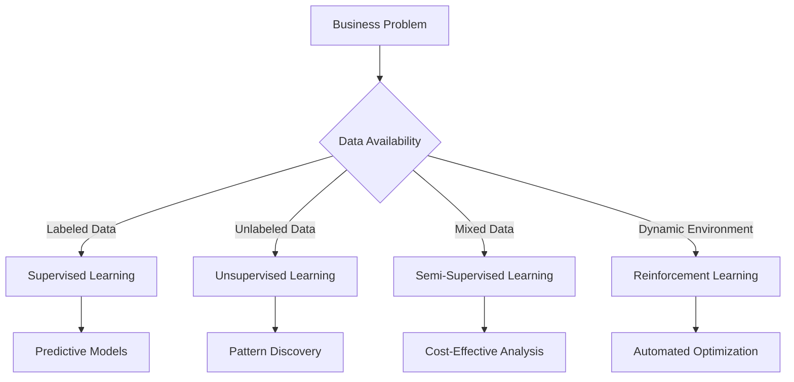
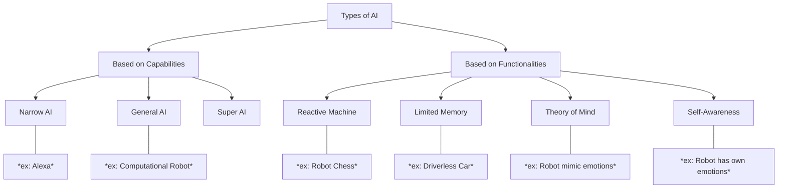

2025-06-10 12:05

Status: #complete 

Tags: #machine-learning #ai #neural-networks

# AI and ML for Business Management
Subject: [[AI and ML for Business Management]]
Lecture: 1 - 9th June 2025
Semester: [[IIIrd Semester]]

# Machine Learning Types
## Supervised Learning (Labelled data; House Price Prediction)
- It relies on datasets containing both ***input*** and ***output*** information enabling ML to make ***prediction***
- **Business Use**: Predictive analytics, forecasting
- Examples: Email spam detection, credit scoring, medical diagnosis.
## Unsupervised Learning (Result type unknown; Text Classification)
- Analyse unlabelled data allowing machine to ***discover the patterns and anomalies*** in large unstructured data sets that may have otherwise gone undetected by humans.
- **Business Use**: Pattern discovery, market segmentation
- Examples: Customer clustering, recommendation systems, fraud detection.
## Semi-Supervised Learning (Categorized Unlabelled data; Custom Segmentation)
- It's mix of both supervised and unsupervised learning where ***small amount of labelled data*** are processed ***alongside larger chunk of raw data***.
- **Business Use**: Cost-effective analysis with limited labelled data
- Examples: Image recognition, speech recognition.
## Reinforcement Learning (Learn from previous data; Driverless Cars)
- Sub-field of ML, that enables AI based system to *take actions in a dynamic environment* through ***trial and error methods*** to maximize the *collective rewards,* based on the feedback generated for respected actions.
- **Business Use**: Dynamic optimization, automated decision-making
- Examples: Gaming AI, trading algorithms, resource allocation.



---
# Neural Networks
Neural Networks are **computational** systems, that make *decisions and prediction* in a way that is **similar to human brain**, processing information through *inter-connected nodes* called "Neurons".
[](http://towardsdatascience.com/understanding-neural-networks-19020b758230/)
These neurons are organized in layers.
1. Input layer that receives **raw data**.
2. One-or-More hidden layers where **information is processed** and **patterns are learned**.
3. Output layer that generates a *final result*.

Each Neuron in each layer has it's own associative **"weights"** and **"thresholds"**.
[](https://www.simplyblock.io/blog/image-recognition-with-neural-networks/)

---
# Fundamentals
## Deep Learning
- It is a sub-field of ML that teaches computers to ***process large quantity of unstructured data***
- Using multi-layer structure of Neurons called *Neural Networks*. Deep learning system can recognize complex patterns in "Text, Images, Audios" and other forms of data to produce accurate insights.

## Generative AI
- Is an application of AI, It refers to a model that creates new content by identifying patterns within massive amount of **annotated data**. Given a prompt or input a model is able to draw a what it has learned to generate relevant, original works in real time.

## Natural Language Process (NLP) 
- It enables computers to understand, interpret and respond to human language it works by breaking down text into elements that a computer can analyse (Words, grammar, context) and identify patterns such as sentence structures and word association.

|                      **Artificial Intelligence**                      |                              **Machine Learning**                              |
| :-------------------------------------------------------------------: | :----------------------------------------------------------------------------: |
|                  AI has ability to apply knowledge.                   |                          ML means gaining knowledge.                           |
| Goal isn't accuracy, but to increase the chance of business sucesses. |                         Goal is to increase accuracy.                          |
|               Creates system that simulate human mind.                |      Helps machine to learn from data to improve accuracy of prediction.       |
|   AI systems may need rule setting and manual tuning in some cases.   |                   ML focuses on reducing human intervention.                   |
|            AI system implementation is a complex process.             | ML implementation invloves a few steps and continues improvement of the model. |
|                    AI system is a decision  maker.                    |            ML enables the system to learn new things from the data.            |



### Based on Capabilities 
#### Narrow AI
- Also know as "**Weak AI**", focuses on limited tasks and can not preform big problems.
- It targets a single subset of cognitive abilities and advances in that area.
- Example: Alexa by Amazon.
#### General AI
- Also knows as "**Strong AI**" can understand and 
- It allows a machine to apply knowledge and skills in different context.
- Example: [Fujitsu built K computer which is the fastest computer.](https://en.wikipedia.org/wiki/K_computer)
#### Super AI
- It surpasses human intelligence, and can perform any tasks better than a human.
- Some of the critical aspects of the Super AI includes "Thinking, solving puzzles, making judgments".
- Example: R2-D2 from the movie Star War which could perform multiple technical operations beyond human.

### Based on Functionalities
#### Reactive Machine
- It is a primary form of AI that doesn't store memory or use past experience to determine future actions.
- It works only with the present data.
- Reactive machines are provided with specific tasks and they don't have capabilities beyond those tasks.
- Example: [IBM deep blue that defeated the world chess champion, Garry Kasparov](https://www.ibm.com/history/deep-blue)
#### Limited Memory
- It trains from past data to make decisions. The memory of thus system is short lived.
- They can use this past data for specific duration of time.
- This kind of technology is used in self driving vehicles.
#### Theory of Mind
- It represents a advance class of technology, such kind of AI requires through understanding that the people and things within an environment can alter feelings and behaviour.
- Example: [Kismet is a robot developed by MIT that can simulate and recognize human emotions.](https://en.wikipedia.org/wiki/Kismet_(robot))
#### Self Awareness
- It only exists hypothetically \*YET\*.
- Such system understands they are internal traits states, conditions and perceive human emotions.
- This type of AI will not only be able to understand and evoke emotions in those they interact with, but also have emotions, needs, and believes of their own. 

---

# Components of AI
- Learning
- Reasoning
- Problem Solving
	1. The AI ability of problem solving comprises data where solution needs to find "x".
	2. The different methods of problem solving count for essential components of intelligence that divides the query into special, general purpose.
- Perception Ability
	1. The elements scans any given environment by using different sense organs either artificial or real.
	2. Further the proses is maintained internally and allow the perceiver to analyze other areas of suggested objects and understand their relationship and features.
- Language Understanding
	1. It can defined as a set of different symbol signs that justify their meaning using convention.
	2. It uses distinctive types of language over different forms of natural meaning  

# Inductive vs Deductive
## inductive
- All mammals have backbones
- Humans are mammals
**Conclusion**: humans have backbones.

## deductive
- Every dog I meant is friendly
**Hypothesis**: "Most dogs are usually friendly"

# AI/ML Workflow

Data Preparation -> Model Training -> Model Evaluation and Iteration -> Model Deployment -> Model Monitoring -> and back to Data Preparation (it's like an iterative process.)  

Step 1: Data Collection
- In this step we gather the data. This could be anything from pictures and text to more complex data like human behavior.
Step 2: Data Preparation
- Once the data is collected it needs to prepared and cleaned. This means removing any irrelevant information and converting the data into a format that the AI system can understand.
Step 3: Choosing an Algorithm
- The AI system uses algorithm to process the data. There are special algorithm for image recognition, natural language processing, etc.
Step 4: Training the Model
- The prepared data is fed in the chosen algorithm to train the AI model during this phase the model learns to make predictions or decision based on the data.
Step 5: Testing the Model
- After training the model is tested to see, how well it performs. If it isn't accurate enough it may be need to trained further.
Step 6: Deployment
- Once the model is trained and tested it's ready to be deployed into a real world application.
Step 7: Ongoing Learning
- Many model AI system have the ability to learn and adapt overtime. This means they can improve their performance as they gather more data. Msking them mroe effecient and accurate.

`This is a book. It is brown.`

1. "This is a book." and "It is brown." **SEGMENTAION**
2. "This", "is", "a", "book.", "and", "It", "is", "brown." **TOKENIZATION**
3. "book", "brown" **STOPWORDS**

## Tool Practice
```python
import nltk # nltk: Natural Language Tool Kit
from nltk.tokenize import word_tokenize, sent_tokenize
from nltk.corpus import stopwords

nltk.download('punkt') # punkt: PUnctuation and KNowledge-based Tokenizer
nltk.download('punkt_tab')

str = "Pune is a city. It is in the West."

sentences = sent_tokenize(str)
print("Sentence:", sentences)

words = word_tokenize(str)
print("Words:", words)


# Lemmatizer with wordnet
from nltk.stem import WordNetLemmatizer
nltk.download('wordnet')


lemmatizer = WordNetLemmatizer()
lemmatized_words = [lemmatizer.lemmatize(word) for word in words]

print(lemmatized_words)


# Sentiment Intensity Analyzer 
from nltk.sentiment import SentimentIntensityAnalyzer
nltk.download('vader_lexicon')

analyzer = SentimentIntensityAnalyzer()
sentiment_scores = analyzer.polarity_scores("word")

print(sentiment_scores)
```

