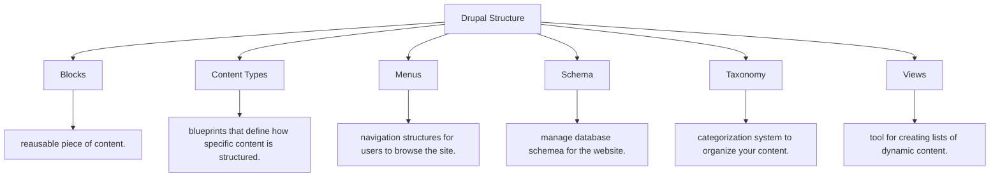

2024-09-15 23:46

Status: #complete 

Tags: [[Creating-drupal-project]]

# Drupal: Structure and it's Content Types
Subject: [[Content Management System]]
# Structures
Drupal’s **Structure** defines how your website is organized. It has various tools that allow you to manage the layout, functionality, and behaviour of the website.



## Content Types
In Content types we have these 3 present
1. `Aricle` is by-default present when we install drupal.
2. `Basic page` is a static-page for pages like: `About us`.
3. We, have `Webform` present as we installed `Webform modules`.
![[drupal-content_types.png]]

Let's edit some content type:
### Structures\\Content type: Webform
let's uncheck some settings to make our website look professional.
- **1st** is on second setting "Publishing options" We do not wish to push everything on the front page, so let's disable that.
	- ![[drupal-content_type_webform_plublishing.png]]
- **2nd**  let's move on to third setting "Display setting" and disable `Display author and date information.`
	- ![[drupal-content_type_webform_display.png]]
- **3rd** The forth setting "Comment settings" and we are going to Hide the comments.
	- ![[drupal-content_type_webform_comment.png]]
- **4th** And finally "Menu settings" where we are going to enable following and then we finally click on `Save content type` button to save all the settings.
	- ![[drupal-content_type_webform_menu.png]]


### Structures\\Content type: Custom content type
Let's create our own Custom content type.
1. **Step 1:** Go on `Structure` tab and then `Content types`.
2. **Step 2:** Press `Add content type`s
	- ![[drupal-custom_content_type.png]]
3. **Step 3:** Add your Content type name, description, etc...and I will also disable things such as
	1. in Publishing options: `Promoted to front page`
	2. in Display settings: `Display author and date information.`
	3. in Comment settings: `Default comment setting for new content: Hidden`. After applying settings by pressing `Save content type` button.
		- ![[drupal-entering_custom_content_type.png]]

Now, we are going to manage it's field by clicking on `Manage Fields` button and add it's properties regardingly for ex: `Title` and `Body` will be present by default, and as I am creating a Component for "Property" I will input the properties needed for the 'Property'
1. Title of the Property (*already present by default.*)
2. Description (*again already present by default as `Body`.*)
3. Property Type (This could be a list like i. House, ii. Apartment, iii. Villa, iv. Unit, etc...)
4. Property Number (There should be a distinction of one property with other so we can add this, which can be used as Primary key later on.)
5. Images (Images are very important.)
6. and finally Price.
I will show you how to add one property so that you can understand, how it's done and you can do others accordingly.
#### Structures\\Content type\\Custom content type: Properties
1. **Step 1:** Select your Content type in my case it's `Property` and click on `manage fields` button.
2. **Step 2:** Input your `field name` in my case it's for Properties Type so it will be `Type` and `Field Type` will be `List (text)` as I need users to choose from a specific list, you can play around with different `field types` according to your need.
	- ![[drupal-managing_fileds_of_content_type.png]]
- **Step 3:** As this a list I will need to write `Allowed values in this format`.  After doing this scroll down a bit and click on `Save settings` button.
```
xyz | xyz
abd | abd
O.O | O.O
```
- ![[drupal-entering_property_type_and_value.png]]
Now you have learnt how to add your own custom fields to the content types, I have gone ahead and added all my fields necessary for my project:
![[drupal-custom_types_manage_fields.png]]
## Structures\\Blocks
This section isn't necessary but if you wish to create a professional looking website then yup it's indeed very helpful.

In `Blocks` section we need to disable two things (you can enable them later if you wish to use them we are going to replace them with our own one.)
1. Search form
2. and `User login` which is not needed for our use-case *and if you are thinking how will we access to login page of the website then?* then you can access the login page by visiting `http://localhost/YOUR-PROJECT-NAME/user.
![[drupal-blocks.png]]
after selecting `- None -` in both of the settings scroll down and click on `Save blocks` to save the settings.
![[drupal-blocks_save.png]]

## Adding Content
As we have added our custom content type and added manage files to them as well let's try and create a `Content` to see how it looks, It might look funky for now but don't worry will make changes to it soon ;)

To create your Content first we need to go to `Content` tab then look for our `Custom content name` that we created earlier, in my case it's `Property.
![[drupal-content.png]]Then fill all the details (as per what you filled in the `manage fileds` previously) and then you can `Preview` your content and publish by clicking on `Save` button.
![[drupal-adding_content.png]]

Oh, I didn't talk about `URL path settings` *hmm...* let's discuss that

### Content: Custom URL
Let's organise our URL's so that it's not gibberish *dynamically*, to do that we will need to go to `Configure URL alias patterns` which can be found in `URL path settings` option.

1. **Step 1:** Click on `URL path settings` option then `Configure URL alias patterns`button.
	- ![[drupal-url_aliases.png]]
2. **Step 2:** It should take you to `URL aliases` page, and that will look something like this:
	-  I have already configured my `urls` ass you can see,
		- Default path pattern is `content/[node:title]` (`node:title` is nothing but the tile of the file and first content is like this: `http://localhost/YOUR-PROJECT-NAME/content/TITLE`.)
		- Article path is in `news/[node:title]` so `http://localhost/YOUR-PROJECT-NAME/article/TITLE`.
		- and so on...You can put the url's according to your project
		- ![[drupal-updating_url_aliases.png]]

Now, let's view our Content that we just created (*I have used a dummy data from this [website](https://www.magicbricks.com/vivanta-next-tathawade-pune-pdpid-4d4235333934363835/prjDtId-4d42313632383933)*)
![[drupal-real_estate_v1.png]]

YaYY **:D** I know it doesn't look beautiful *;-;* we will first focus on implementing all the **FUN***ctuanlities* ;-; not really fun but it is what it is ;-;

Now. Let's move on to setting up our website's User Role and stuff.