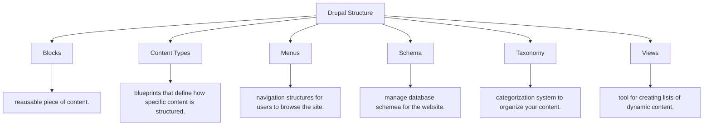

2024-09-15 23:46

Status: #ongoing 

Tags: 

# Drupal: Structure and it's Content Types
Subject: [[Content Management System]]

# Structures
Drupal’s **Structure** defines how your website is organized. It has various tools that allow you to manage the layout, functionality, and behaviour of the website.

## Content Types
In Content types we have these 3 present
1. `Aricle` is by-default present when we install drupal.
2. `Basic page` is a static-page for pages like: `About us`.
3. We, have `Webform` present as we installed `Webform modules`.
![[drupal-content_types.png]]

Let's edit some content type:
### Structures\\Content type: Webform
let's uncheck some settings to make our website look professional.
- **1st** is on second setting "Publishing options" We do not wish to push everything on the front page, so let's disable that.
	- ![[drupal-content_type_webform_plublishing.png]]
- **2nd**  let's move on to third setting "Display setting" and disable `Display author and date information.`
	- ![[drupal-content_type_webform_display.png]]
- **3rd** The forth setting "Comment settings" and we are going to Hide the comments.
	- ![[drupal-content_type_webform_comment.png]]
- **4th** And finally "Menu settings" where we are going to enable following and then we finally click on `Save content type` button to save all the settings.
	- ![[drupal-content_type_webform_menu.png]]

### Structures\\Content type: Custom content type
Let's create our own Custom content type

## Structures\\Blocks
In `Blocks` section we need to disable two things (you can enable them later if you wish to use them we are going to replace them with our own one.)
1. Search form
2. and `User login` which is not needed for our use-case *and if you are thinking how will we access to login page of the website then?* then you can access the login page by visiting `http://localhost/YOUR-PROJECT-NAME/user.
![[drupal-blocks.png]]
after selecting `- None -` in both of the settings scroll down and click on `Save blocks` to save the settings.
![[drupal-blocks_save.png]]