# Brainstorming Ideas for the app

## 1. [The Golden Triangle](https://www.mermaidchart.com/raw/d81c192e-3ac0-47f7-90f4-cce3cfb7b251?theme=dark&version=v0.1&format=svg)

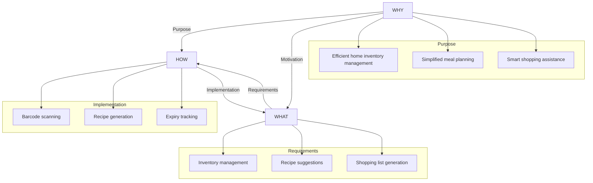

- **WHY**: This is the core purpose of the app, the motivation behind its creation.
- **HOW**: Describes the methods and techniques used to achieve the goals.
- **WHAT**: The tangible results and core functionalities of the app.

## 2. [System Overview](https://www.mermaidchart.com/raw/cf206e7b-1436-4272-a198-cf9bf26b9f56?theme=dark&version=v0.1&format=svg)

```mermaid
flowchart TB
    A[Brain of our App] 

    %% User Management Subgraph
    subgraph User Management
        direction TB
        B[User Authentication & Database]
        H[User Profiles]
        I[Inventory Records]

        %% User Features Subgraph
        subgraph User Features
            direction LR
            J[Profile Customization]
            K[User Preferences]
            L[Community Sharing]
            M[Group Inventory Management]
        end
    end

    %% API Management Subgraph
    subgraph API Management
        direction TB
        C[API]
        
        %% Recipe Database Subgraph
        subgraph Recipe Database
            direction TB
            N[Recipe Categories]

            %% Input and Output Details
            subgraph Input & Output
                direction LR
                O[Input Ingredients]
                P[Input Food Type]
                Q[Input Time]
                R[Input Servings]
                S[Output Recipe Suggestions]
            end

            T[Recipe Ingredients]
            U[Cooking Instructions]
            V[Nutritional Information]
        end
        
        %% Groceries/Product Information Subgraph
        subgraph Groceries/Product Information
            direction LR
            W[Product Categories]
            X[Product Details]
            Y[Nutritional Information]
            Z[Barcode Data]
        end
    end

    %% Inventory Management Subgraph
    subgraph Inventory Management
        direction TB
        E[Inventory Management]
        F[Low Stock Alerts]
        G[Expiry Dates]

        %% Inventory Features Subgraph
        subgraph Inventory Features
            direction LR
            AA[Track Inventory Levels]
            AB[Inventory Search]
            AC[Sort/Filter Options]
            AD[Product History]
        end
    end

    %% Recipe Engine Subgraph
    subgraph Recipe Engine
        direction TB
        AE[Recipe Engine]
        AF[Custom Recipe Generation]
        AG[Ingredient Substitution Suggestions]
        AH[Meal Planning]
        AI[Favorite Recipes]
        AJ[API Integration]
        AK[Data Retrieval]
    end

    %% Barcode Scanning Subgraph
    subgraph Barcode Scanning
        direction TB
        AL[Barcode/QR Scanner]
        AM[Scanned Item Data]
        AN[Integrate with Inventory]
        AO[Product Information Lookup]
    end

    %% Notification System Subgraph
    subgraph Notifications
        direction TB
        AP[Notification System]

        %% General Notifications Subgraph
        subgraph General Notifications
            direction TB
            AQ[Expiry Notifications]
            AR[Low Stock Notifications]
            AS[Daily Reminders]
        end

        %% Recipe Notifications Subgraph
        subgraph Recipe Notifications
            direction TB
            AT[Recipe Suggestions]
            AU[Community Sharing Alerts]
            AV[Custom Recipe Reminders]
            AW[Favorite Recipe Updates]
        end
    end

    %% Connections
    A --> B
    A --> C
    A --> E
    A --> AE
    A --> AP

    %% User Management Connections
    B -->|Stores user data| H
    B -->|Stores inventory data| I
    B -->|Customizes user experience| J
    B -->|Saves user preferences| K
    B -->|Allows sharing among users| L
    B -->|Manages group inventories| M

    %% API Management Connections
    C -->|Provides recipe data| N
    C -->|Provides product data| W

    %% Recipe Database Details
    N -->|Takes inputs from| O
    N -->|Takes inputs from| P
    N -->|Takes inputs from| Q
    N -->|Takes inputs from| R
    N -->|Generates| S
    N -->|Contains| T
    N -->|Includes| U
    N -->|Includes| V

    %% Product Information Details
    W -->|Includes| X
    W -->|Includes| Y
    W -->|Includes| Z

    %% Inventory Management Connections
    E -->|Manages| I
    E -->|Tracks| G
    E -->|Monitors| F
    E -->|Searches| AB
    E -->|Sorts/Filters| AC
    E -->|Maintains| AD
    E -->|Updates| AA

    %% Recipe Engine Details
    AE -->|Generates| AF
    AE -->|Suggests substitutions| AG
    AE -->|Helps with planning| AH
    AE -->|Saves favorites| AI
    AE -->|Utilizes ingredients from| I
    AE -->|Retrieves data from| AJ
    AJ -->|Fetches data from| C
    AJ -->|Retrieves output from| AK

    %% Barcode/QR Scanner Connections
    AL -->|Scans| AM
    AL -->|Integrates with| AN
    AL -->|Retrieves info from| AO

    %% Notification System Connections
    AP -->|Sends alerts for| AQ
    AP -->|Sends alerts for| AR
    AP -->|Reminds users daily| AS
    AP -->|Provides suggestions for| AT
    AP -->|Shares community updates| AU
    AP -->|Sends custom recipe reminders| AV
    AP -->|Updates on favorite recipes| AW

```

Absolutely! Let’s break down the main screens and components of the app, as well as the admin section where administrators can manage and analyse user data. I’ll present the information in a clear, structured format.

## 3. Main Screens and Components

1. **Home Dashboard**
   - **Overview**: Provides a snapshot of inventory levels, upcoming expiry dates, and visual representation of everything.
   - **Components**:
     - Quick Access Menu (Inventory, Recipes, Scanner, Notifications)
     - Summary Cards (Low Stock, Expiry Alerts, Recently Added Items)
     - Recipe Suggestion Carousel
     - Notification Center

2. **Inventory Screen**
   - **Overview**: Displays the list of all groceries/products in the user's inventory.
   - **Components**:
     - Inventory List (sortable and filterable)
     - Search Bar
     - Add New Item Button (including barcode scanner option)
     - Item Details View (expiry date, quantity, nutritional info)
     - Edit and Delete Buttons for each item
     - Low Stock Alerts
     - Expiry Date Management

3. **Recipe Screen**
   - **Overview**: Allows users to find and manage recipes based on available ingredients.
   - **Components**:
     - Recipe Search Bar
     - Filter Options (meal type, dietary restrictions, prep time)
     - Suggested Recipes List
     - Recipe Details View (ingredients, instructions, cooking time, nutritional info)
     - Add to Favorites Button
     - Generate Recipe Button (input ingredients, time, servings)
     - Shopping List Generator (from selected recipes)

4. **Barcode Scanner Screen**
   - **Overview**: Enables users to scan barcodes for quick addition to inventory.
   - **Components**:
     - Camera Viewfinder
     - Manual Entry Option
     - Scanned Item Confirmation
     - Option to Add to Inventory
     - History of Scanned Items

5. **Notifications Screen**
   - **Overview**: Displays notifications related to inventory, recipes, and community.
   - **Components**:
     - Notification List (expiry alerts, low stock alerts, recipe reminders)
     - Filter Options (by type of notification)
     - Settings for Notification Preferences (push notifications, email reminders)

6. **User Profile Screen**
   - **Overview**: Displays and allows editing of user-specific settings and preferences.
   - **Components**:
     - User Information (name, email, preferences)
     - Dietary Preferences (allergies, meal types)
     - Community Sharing Settings
     - Sync Options with Other Devices
     - Privacy Settings

---

### **Admin Section**

1. **Admin Dashboard**
   - **Overview**: Central hub for administrators to monitor app activity and user engagement.
   - **Components**:
     - User Statistics (active users, total recipes created, inventory items tracked)
     - Quick Actions (view user data, manage inventory categories, review reports)
     - Recent Activity Feed (user logins, item additions, recipe searches)

2. **User Management Panel**
   - **Overview**: Allows administrators to manage user accounts and view their data.
   - **Components**:
     - User List (sortable by activity, registration date)
     - User Profile View (detailed insights into user activity, preferences)
     - Edit User Permissions (e.g., community roles, notification settings)
     - Disable/Enable User Accounts

3. **Inventory Management Panel**
   - **Overview**: Provides insights into inventory trends and item popularity across users.
   - **Components**:
     - Inventory Overview (most popular items, common expiry dates)
     - Item Analytics (usage frequency, average quantities)
     - Bulk Item Management (add/remove categories, update product info)
     - Alerts and Notifications Setup for Users

4. **Recipe Management Panel**
   - **Overview**: Allows administrators to manage and analyze recipe data.
   - **Components**:
     - Recipe Overview (most searched recipes, trending ingredients)
     - Recipe Creation/Editing Tool (add/edit recipes to the database)
     - User Feedback Section (ratings and comments on recipes)
     - Dietary Restrictions Analysis (common user preferences)

5. **Reports and Analytics Section**
   - **Overview**: Provides comprehensive reports on user behavior, inventory usage, and recipe popularity.
   - **Components**:
     - User Activity Reports (logins, inventory updates, recipe creations)
     - Inventory Usage Trends (most stocked vs. least stocked items)
     - Recipe Engagement Metrics (views, saves, cooking frequency)
     - Export Data Options (CSV, PDF)

6. **Settings and Configuration Panel**
   - **Overview**: For administrative control over app settings and configurations.
   - **Components**:
     - Manage Notification Settings (default settings for new users)
     - Configure API Settings (integrate new recipe sources)
     - User Feedback Management (review and respond to user feedback)
     - Privacy Policy and Terms of Service Management

## 4. Core Systems and Workflows

### 4.1 Adding to Inventory

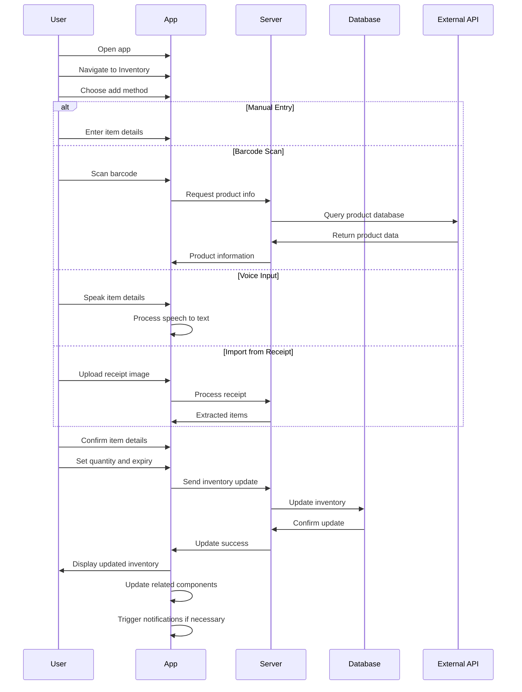

### 4.2 Recipe Search and Generation

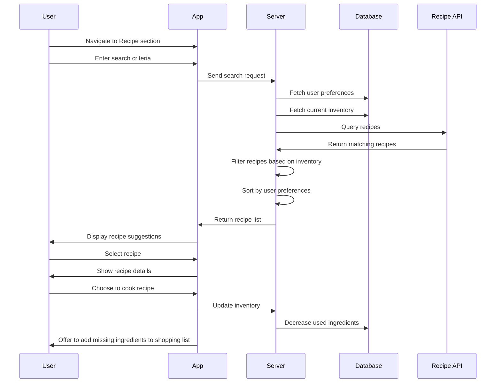

### 4.3 Expiry Date and Low Stock Management

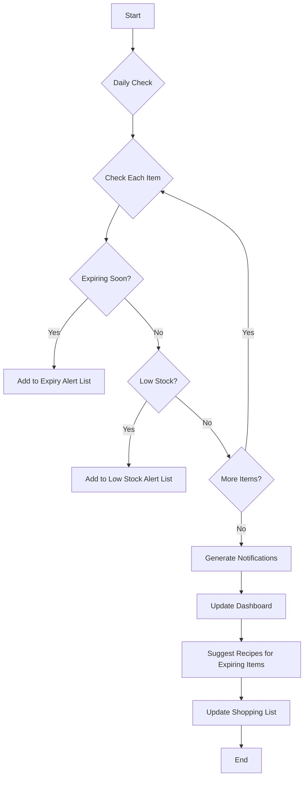

### 4.4 Community and Sharing Features

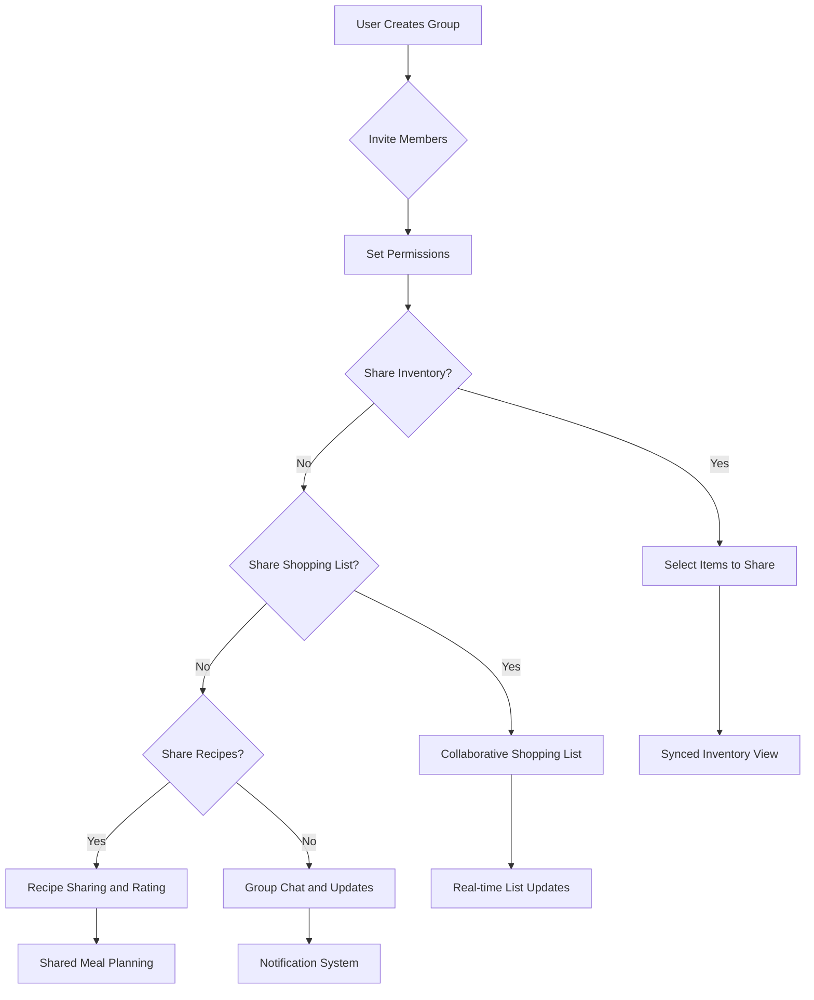

## 5. Integration and Data Flow

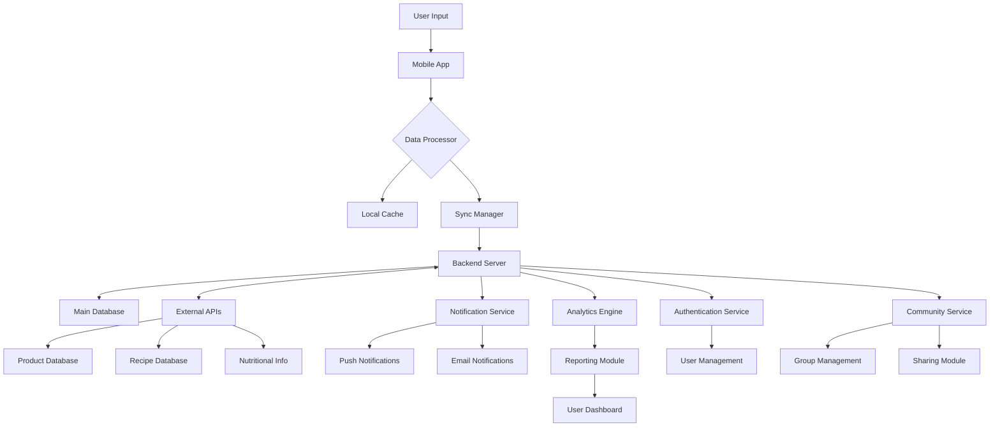

## 6. More Feature's Breakdown

### 6.1 Smart Reordering

The Smart Reordering system automates the process of replenishing frequently used items in the user's inventory.

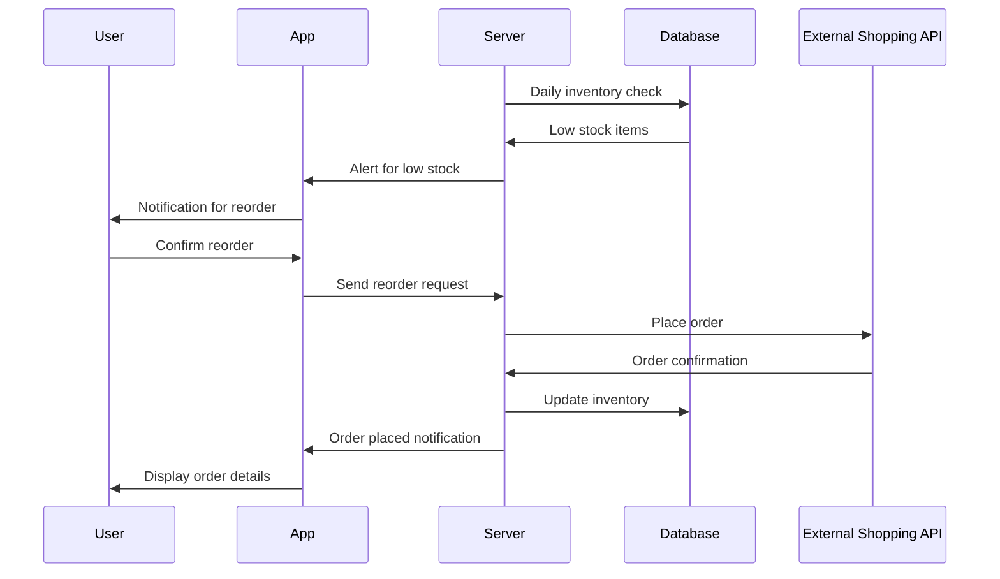

Key Features:
- Customizable reorder points for each item
- Learning algorithm to predict usage patterns
- Integration with preferred online grocery services
- Option for automatic reordering or user confirmation
- Bulk ordering suggestions for frequently used items

### 6.2 Dietary Analysis

The Dietary Analysis feature provides users with insights into their nutritional intake based on their inventory and consumed recipes.

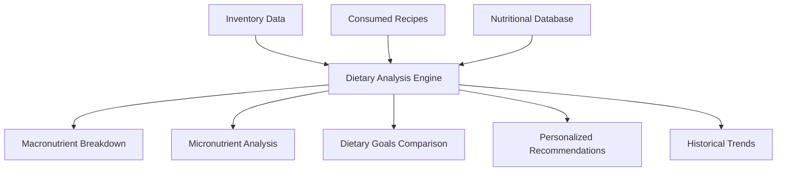

Key Features:
- Analysis of consumed meals and recipes
- Comparison with recommended daily intakes
- Personalized suggestions for balanced nutrition
- Tracking of dietary goals and restrictions
- Integration with health apps and fitness trackers

### 6.3 Seasonal Recommendations

This feature provides users with suggestions and insights based on the current season, local produce availability, and weather conditions.

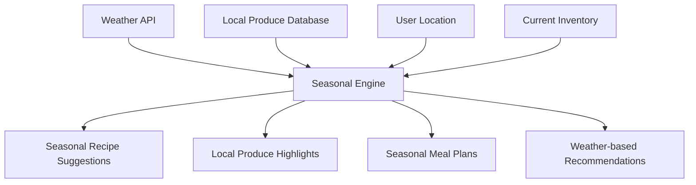

Key Features:
- Integration with local weather data
- Database of seasonal produce by region
- Highlighting seasonal items in inventory and shopping lists
- Seasonal recipe suggestions
- Tips for storing and preserving seasonal produce
- Weather-based meal recommendations (e.g., warm soups on cold days)

### 6.4 Daily Tips System

A system that provides users with daily quotes, tips, and insights related to cooking, nutrition, and inventory management.

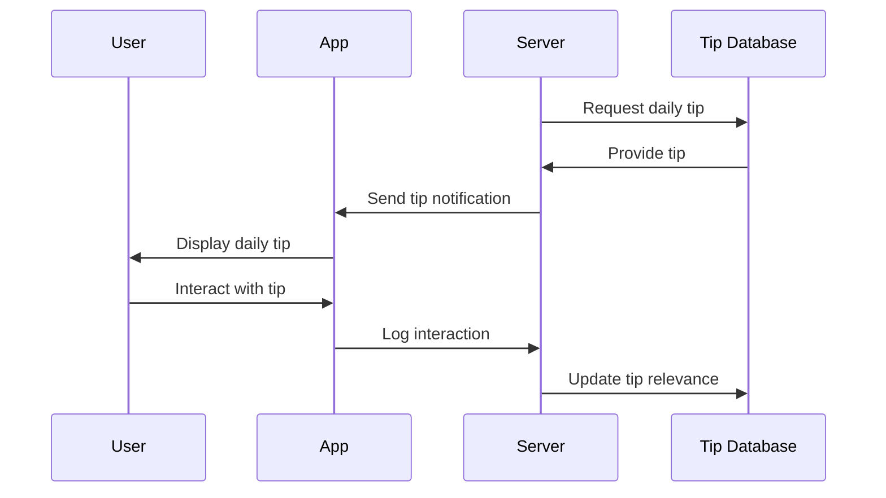

Key Features:
- Daily push notifications with tips
- Categorized tips (cooking, nutrition, storage, etc.)
- User rating system for tips
- Personalized tip selection based on user behavior and preferences

### 6.5 Leftover Manager

The Leftover Manager helps users efficiently use up leftover ingredients and reduce food waste.

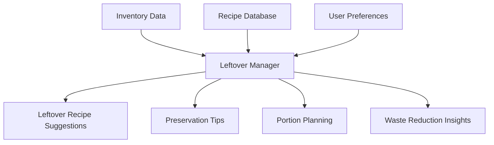

Key Features:
- Identification of potential leftover ingredients
- Customized recipe suggestions for using leftovers
- Tips for properly storing and preserving leftovers
- Portion planning to minimize leftovers
- Integration with meal planner for incorporating leftovers
- Tracking and visualization of waste reduction efforts

### 6.6 Price Tracker

The Price Tracker monitors the cost of items over time, helping users make informed purchasing decisions.

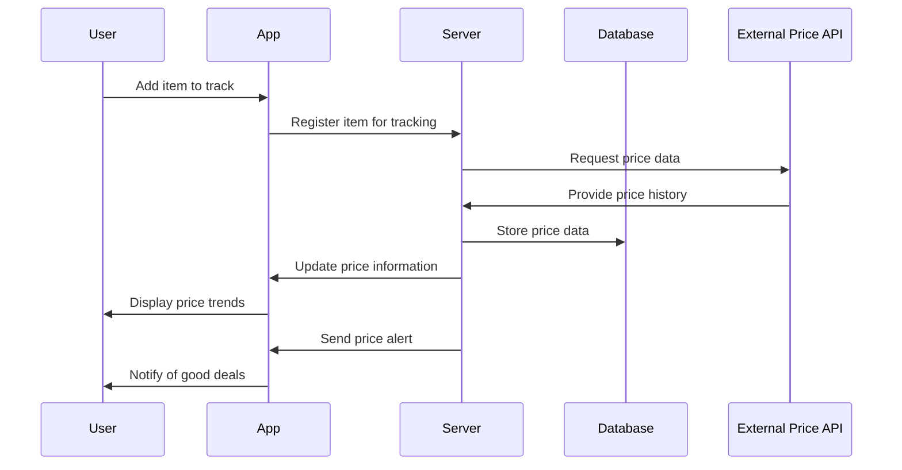

Key Features:
- Historical price tracking for each item
- Price comparison across different stores
- Alerts for price drops and good deals
- Integration with shopping list for optimal purchase timing
- Visualization of price trends over time

### 3.7 Eco-Impact Tracker

The Eco-Impact Tracker helps users understand and reduce the environmental impact of their food choices and consumption habits.

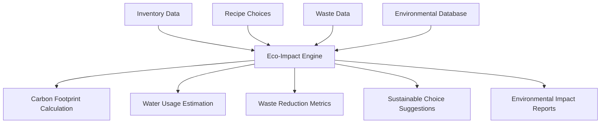

Key Features:
- Calculation of carbon footprint for inventory and meals
- Estimation of water usage in food production
- Tracking of waste reduction efforts
- Suggestions for more sustainable food choices
- Comparison of environmental impact of different recipes

### 6.8 Multi-location Inventory (**Digital Twin of Kitchen**)

This feature allows users to manage and visualize their inventory across multiple storage locations, creating a digital twin of their physical storage spaces.

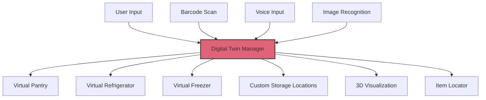

Key Features:
- Creation of virtual storage spaces mirroring physical locations
- Visualization of storage spaces (AR?)
- Easy drag-and-drop item management
- Quick item locator within storage spaces
- Customizable storage categories and locations

### 6.9 Voice-Controlled Cooking Assistant (*while cooking?*)

A voice-activated assistant that guides users through recipes and helps with various kitchen tasks.

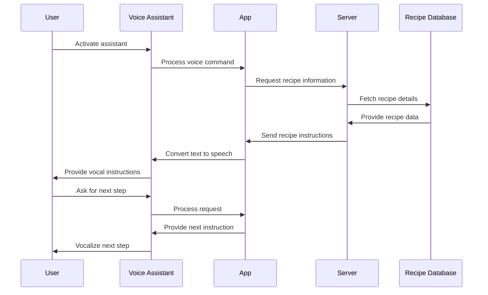

Key Features:
- Hands-free recipe navigation
- Voice-activated timers and reminders
- Ingredient substitution suggestions
- Integration with smart home devices for oven control, etc.
- Multi-language support for diverse users

### 6.10 Allergen Alerts (***imp***)

A comprehensive system to warn users about potential allergens in recipes, scanned products, and inventory items.

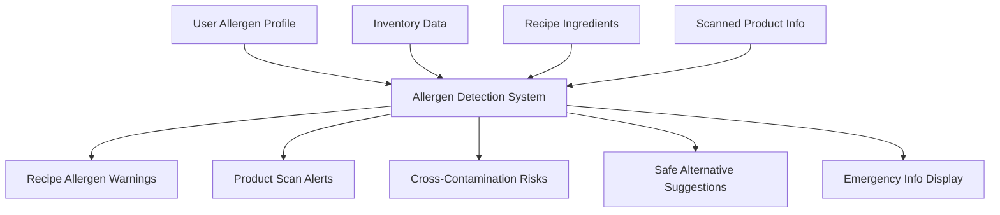

Key Features:
- Customizable user allergen profiles
- Real-time allergen detection in scanned products
- Allergen highlighting in recipes and inventory
- Suggestions for allergen-free alternatives
- Warnings for potential cross-contamination